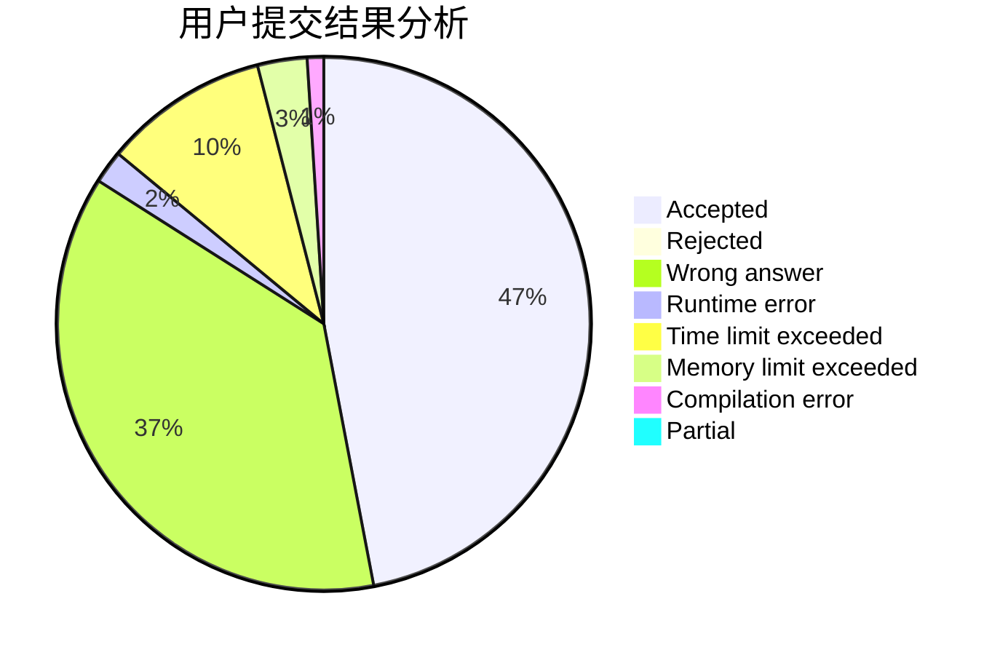
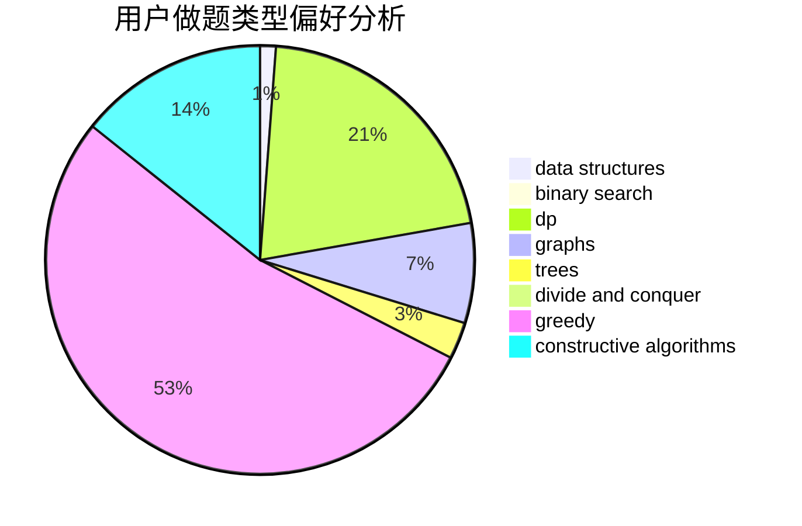
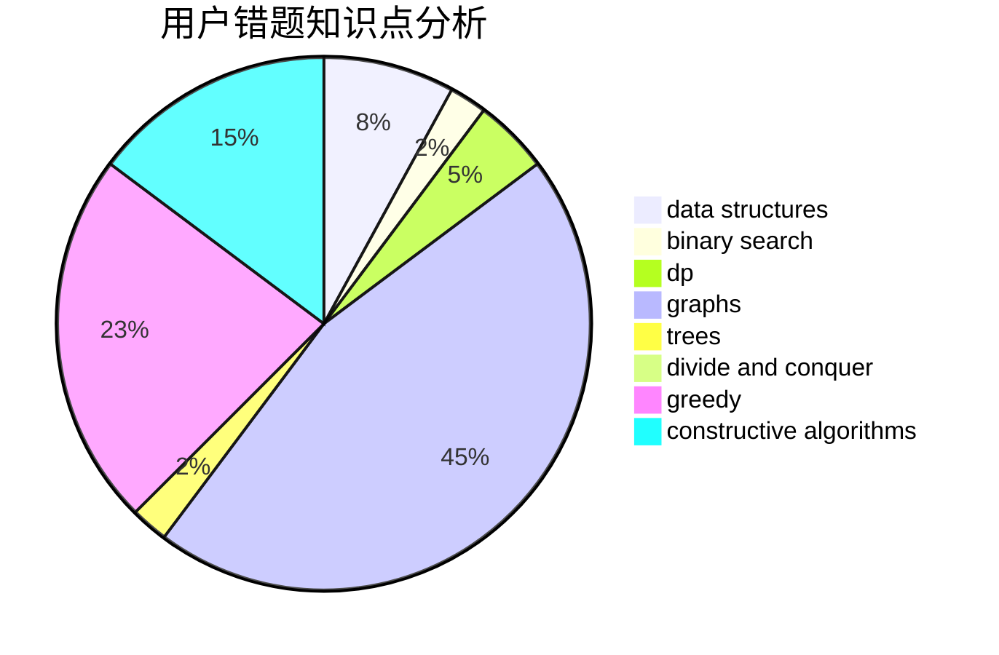

# tom0727

<!-- tabs:start -->

#### **用户提交结果分析**

#### **用户做题类型偏好分析**

#### **用户错题知识点分析**

<!-- tabs:end -->
# 推荐题目
[215B](https://codeforces.com/contest/215/problem/B)		greedy,
                        math		  
[940B](https://codeforces.com/contest/940/problem/B)		dp,
                        greedy		  
[421B](https://codeforces.com/contest/421/problem/B)		dsu,graphs,sortings,trees		  
[623B](https://codeforces.com/contest/623/problem/B)		dp,
                        greedy,
                        number theory		  
[27A](https://codeforces.com/contest/27/problem/A)		implementation,
                        sortings		  
[762C](https://codeforces.com/contest/762/problem/C)		binary search,
                        hashing,
                        strings,
                        two pointers		  
[1132E](https://codeforces.com/contest/1132/problem/E)		dfs and similar,
                        dp,
                        greedy		  
[224B](https://codeforces.com/contest/224/problem/B)		bitmasks,
                        implementation,
                        two pointers		  
[485D](https://codeforces.com/contest/485/problem/D)		dsu,graphs,sortings,trees		  
[1444A](https://codeforces.com/contest/1444/problem/A)		brute force,
                        math,
                        number theory		  
