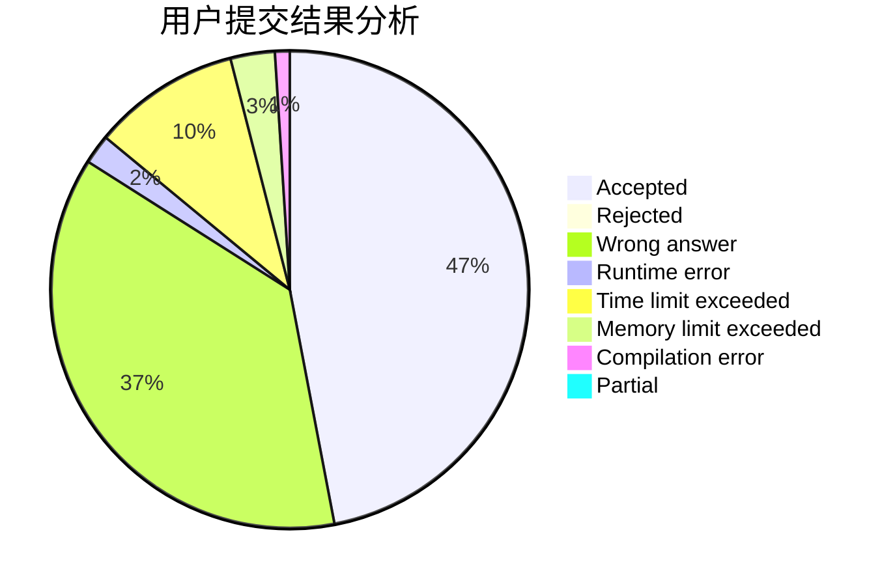
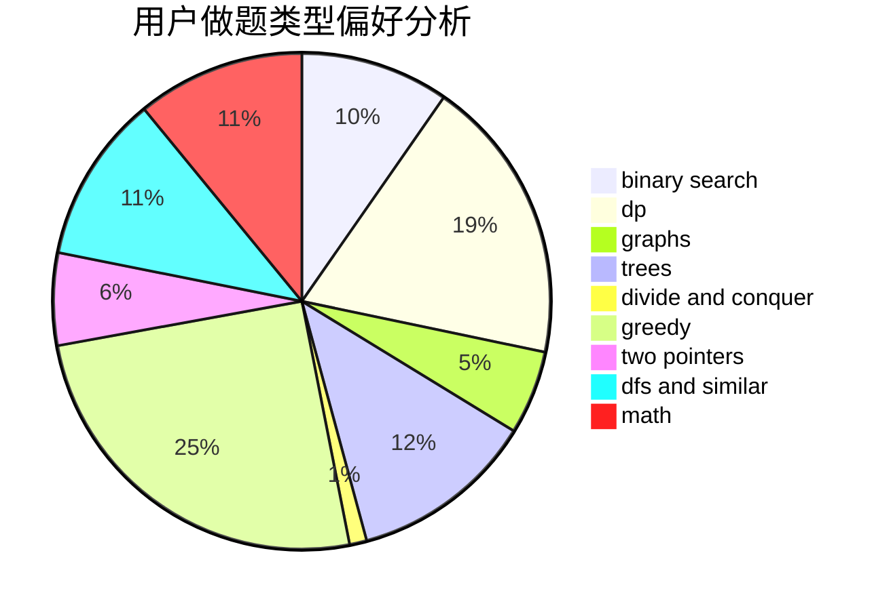

# tom0727

<!-- tabs:start -->

#### **用户提交结果分析**

#### **用户做题类型偏好分析**

<!-- tabs:end -->
# 推荐题目
[234A](https://codeforces.com/contest/234/problem/A)
[961F](https://codeforces.com/contest/961/problem/F)
[446D](https://codeforces.com/contest/446/problem/D)
[651B](https://codeforces.com/contest/651/problem/B)
[294E](https://codeforces.com/contest/294/problem/E)
[780G](https://codeforces.com/contest/780/problem/G)
[1136D](https://codeforces.com/contest/1136/problem/D)
[243B](https://codeforces.com/contest/243/problem/B)
[506C](https://codeforces.com/contest/506/problem/C)
[1453E](https://codeforces.com/contest/1453/problem/E)
