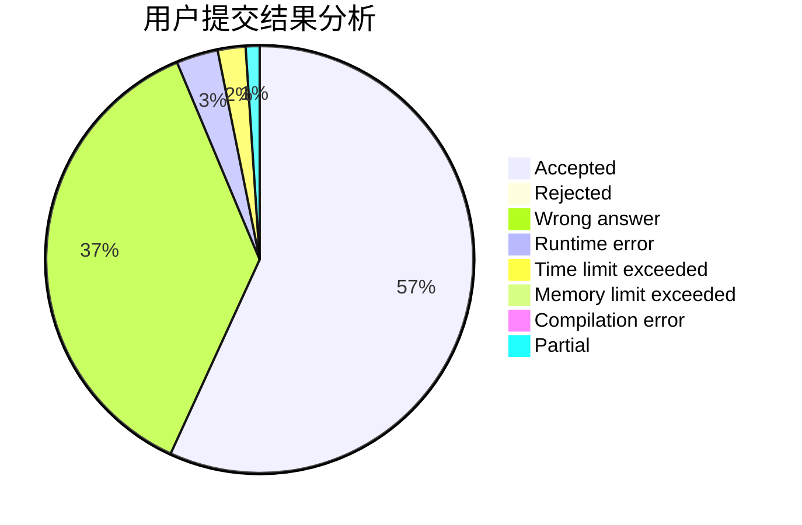
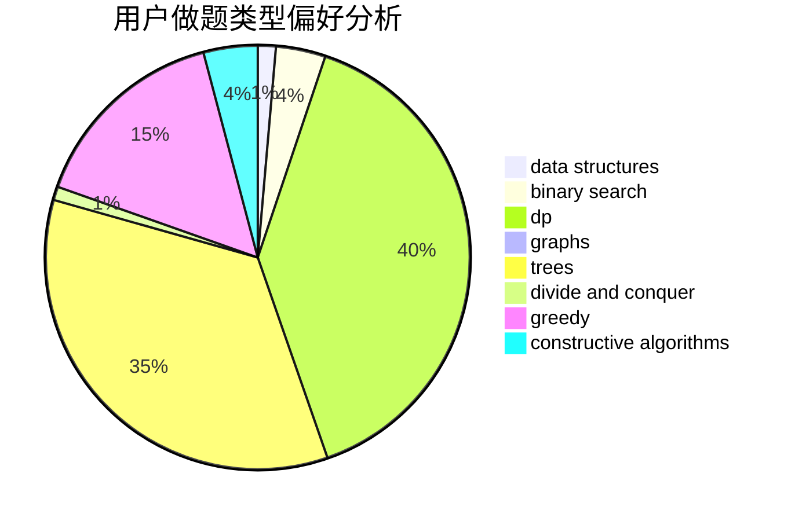

# tomato_potato

<!-- tabs:start -->

#### **用户提交结果分析**

#### **用户做题类型偏好分析**

#### **用户错题知识点分析**

<!-- tabs:end -->
# 推荐题目
[370A](https://codeforces.com/contest/370/problem/A)		graphs,
                        math,
                        shortest paths		  
[25A](https://codeforces.com/contest/25/problem/A)		brute force		  
[1249F](https://codeforces.com/contest/1249/problem/F)		dp,
                        trees		  
[284E](https://codeforces.com/contest/284/problem/E)		dsu,graphs,sortings,trees		  
[414C](https://codeforces.com/contest/414/problem/C)		combinatorics,
                        divide and conquer		  
[233A](https://codeforces.com/contest/233/problem/A)		implementation,
                        math		  
[1203A](https://codeforces.com/contest/1203/problem/A)		implementation		  
[598E](https://codeforces.com/contest/598/problem/E)		brute force,
                        dp		  
[821D](https://codeforces.com/contest/821/problem/D)		dfs and similar,
                        graphs,
                        shortest paths		  
[444E](https://codeforces.com/contest/444/problem/E)		binary search,
                        dsu,
                        trees		  
