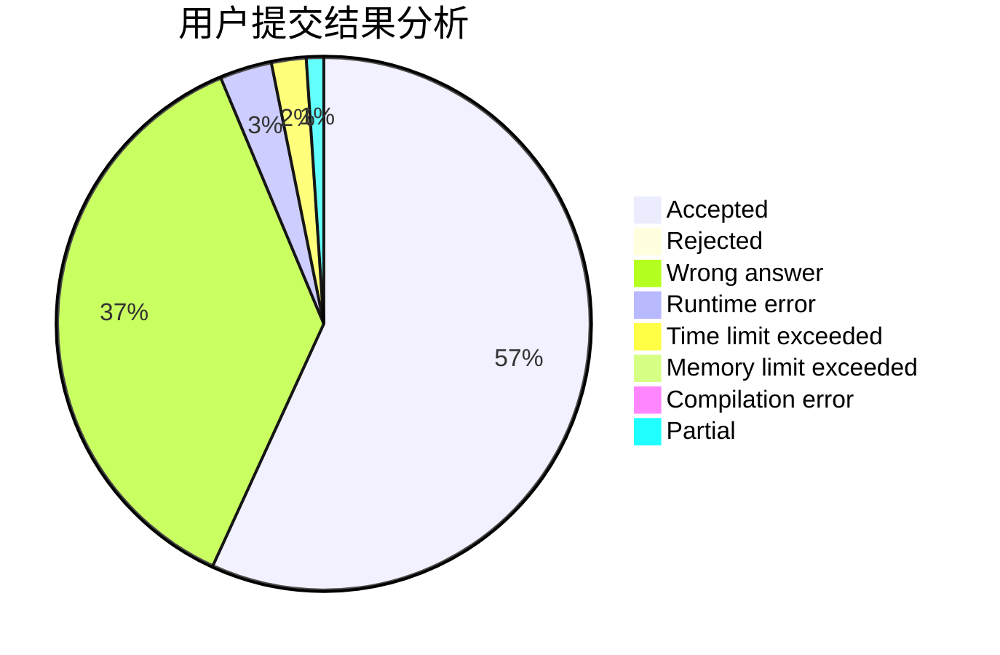
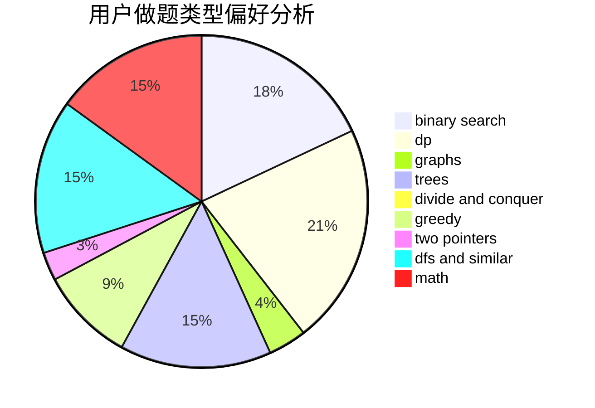

# tomato_potato

<!-- tabs:start -->

#### **用户提交结果分析**

#### **用户做题类型偏好分析**

<!-- tabs:end -->
# 推荐题目
[370A](https://codeforces.com/contest/370/problem/A)
[25A](https://codeforces.com/contest/25/problem/A)
[1249F](https://codeforces.com/contest/1249/problem/F)
[284E](https://codeforces.com/contest/284/problem/E)
[414C](https://codeforces.com/contest/414/problem/C)
[233A](https://codeforces.com/contest/233/problem/A)
[1203A](https://codeforces.com/contest/1203/problem/A)
[598E](https://codeforces.com/contest/598/problem/E)
[821D](https://codeforces.com/contest/821/problem/D)
[444E](https://codeforces.com/contest/444/problem/E)
