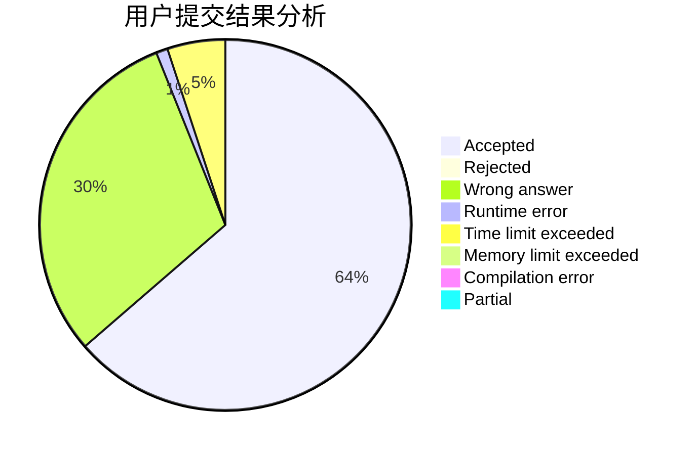
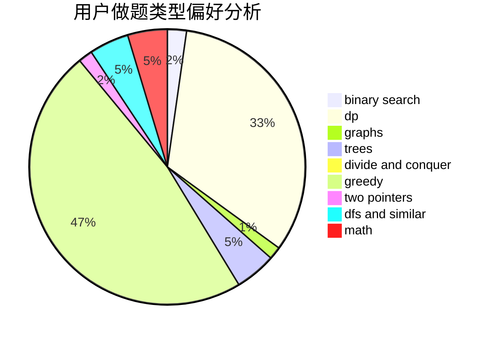

# tommyjiang

<!-- tabs:start -->

#### **用户提交结果分析**

#### **用户做题类型偏好分析**

<!-- tabs:end -->
# 推荐题目
[912E](https://codeforces.com/contest/912/problem/E)
[671A](https://codeforces.com/contest/671/problem/A)
[193B](https://codeforces.com/contest/193/problem/B)
[708A](https://codeforces.com/contest/708/problem/A)
[1444D](https://codeforces.com/contest/1444/problem/D)
[577E](https://codeforces.com/contest/577/problem/E)
[907D](https://codeforces.com/contest/907/problem/D)
[852I](https://codeforces.com/contest/852/problem/I)
[44I](https://codeforces.com/contest/44/problem/I)
[1455E](https://codeforces.com/contest/1455/problem/E)
