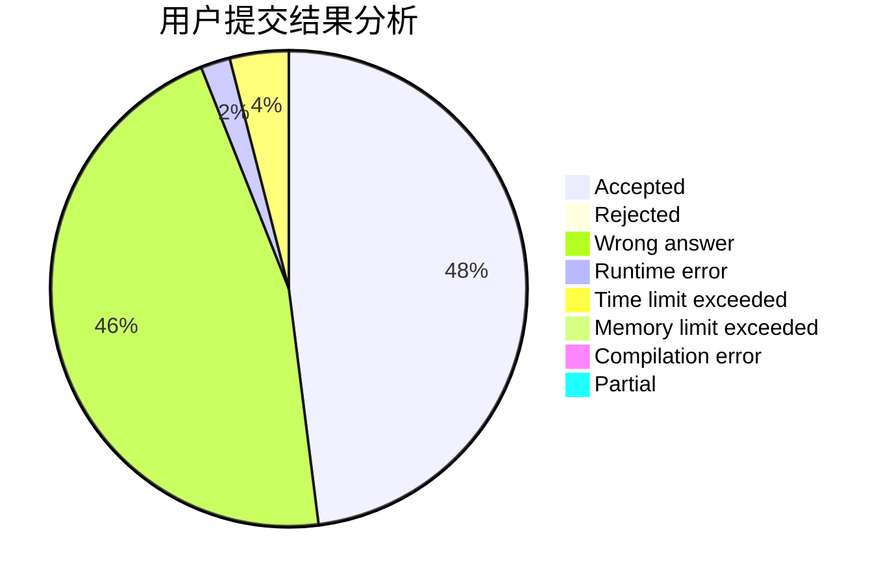
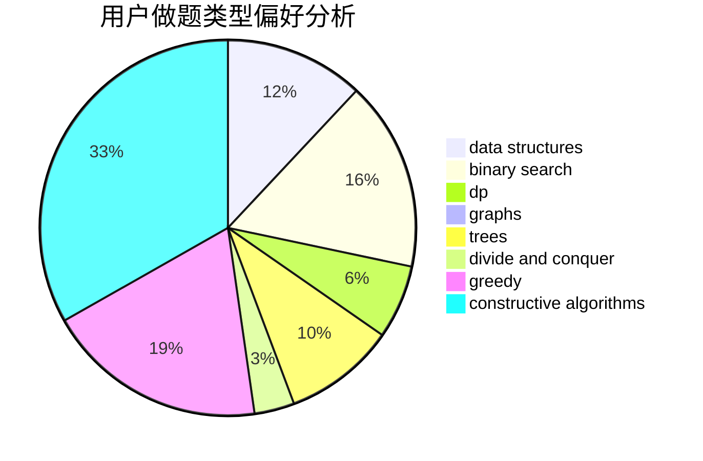
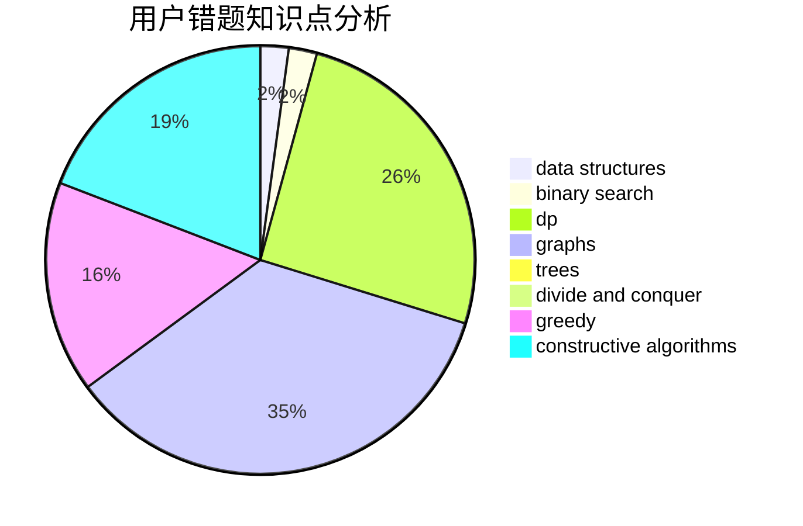

# toted

<!-- tabs:start -->

#### **用户提交结果分析**

#### **用户做题类型偏好分析**

#### **用户错题知识点分析**

<!-- tabs:end -->
# 推荐题目
[525B](https://codeforces.com/contest/525/problem/B)		constructive algorithms,
                        greedy,
                        math,
                        strings		  
[865G](https://codeforces.com/contest/865/problem/G)		combinatorics,
                        math,
                        matrices		  
[616B](https://codeforces.com/contest/616/problem/B)		games,
                        greedy		  
[533B](https://codeforces.com/contest/533/problem/B)		dfs and similar,
                        dp,
                        graphs,
                        strings,
                        trees		  
[674D](https://codeforces.com/contest/674/problem/D)		dsu,graphs,sortings,trees		  
[1292E](https://codeforces.com/contest/1292/problem/E)		constructive algorithms,
                        greedy,
                        interactive,
                        math		  
[59E](https://codeforces.com/contest/59/problem/E)		graphs,
                        shortest paths		  
[1007E](https://codeforces.com/contest/1007/problem/E)		dp		  
[1078B](https://codeforces.com/contest/1078/problem/B)		dsu,graphs,sortings,trees		  
[1005B](https://codeforces.com/contest/1005/problem/B)		brute force,
                        implementation,
                        strings		  
