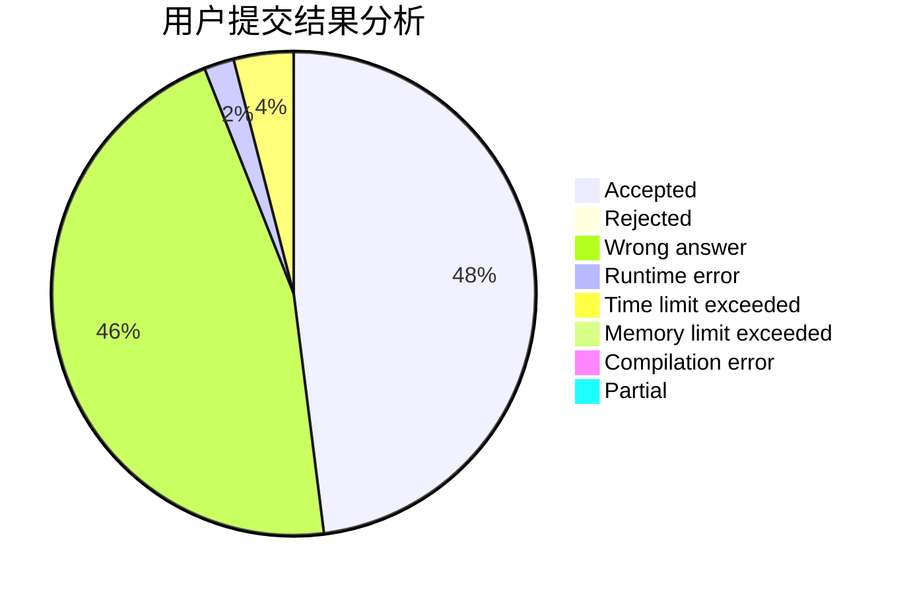
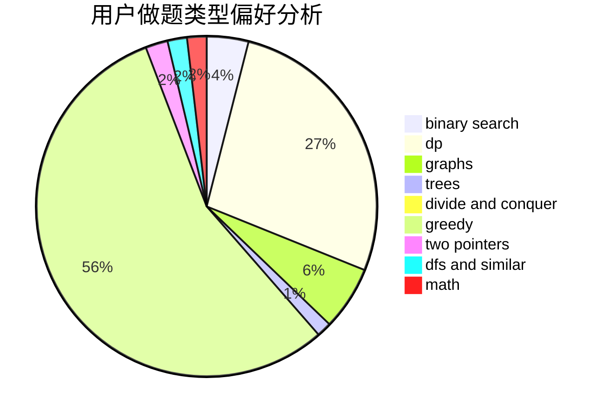

# toted

<!-- tabs:start -->

#### **用户提交结果分析**

#### **用户做题类型偏好分析**

<!-- tabs:end -->
# 推荐题目
[549E](https://codeforces.com/contest/549/problem/E)
[886C](https://codeforces.com/contest/886/problem/C)
[633G](https://codeforces.com/contest/633/problem/G)
[554A](https://codeforces.com/contest/554/problem/A)
[699B](https://codeforces.com/contest/699/problem/B)
[1299E](https://codeforces.com/contest/1299/problem/E)
[618D](https://codeforces.com/contest/618/problem/D)
[1008C](https://codeforces.com/contest/1008/problem/C)
[1078E](https://codeforces.com/contest/1078/problem/E)
[1005C](https://codeforces.com/contest/1005/problem/C)
