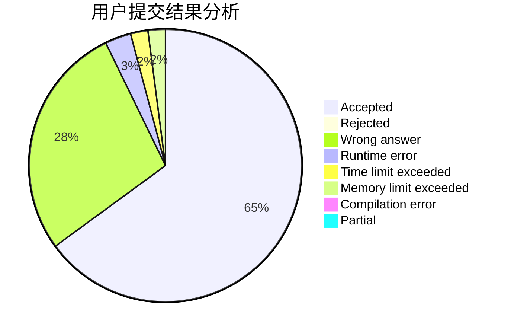
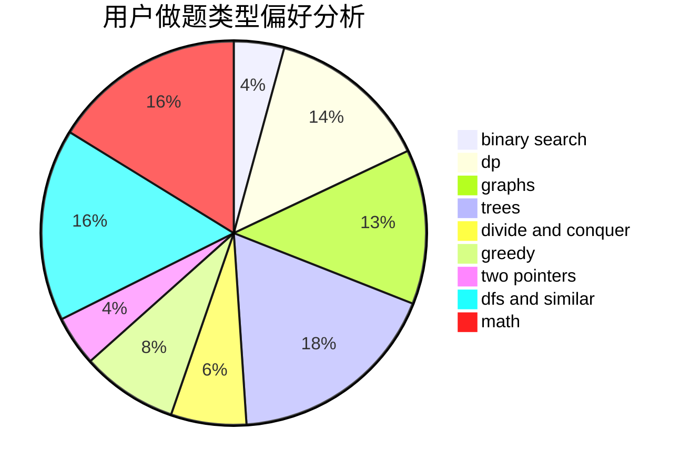

# triccsr

<!-- tabs:start -->

#### **用户提交结果分析**

#### **用户做题类型偏好分析**

<!-- tabs:end -->
# 推荐题目
[665D](https://codeforces.com/contest/665/problem/D)
[353A](https://codeforces.com/contest/353/problem/A)
[1261F](https://codeforces.com/contest/1261/problem/F)
[448C](https://codeforces.com/contest/448/problem/C)
[402D](https://codeforces.com/contest/402/problem/D)
[737A](https://codeforces.com/contest/737/problem/A)
[65A](https://codeforces.com/contest/65/problem/A)
[919E](https://codeforces.com/contest/919/problem/E)
[1290B](https://codeforces.com/contest/1290/problem/B)
[845G](https://codeforces.com/contest/845/problem/G)
