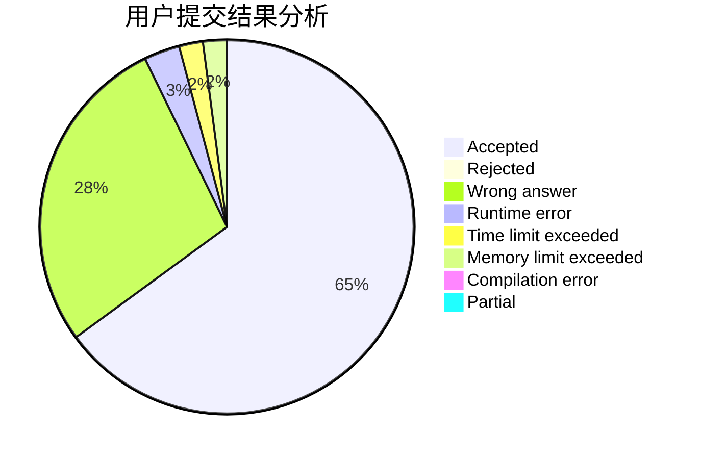
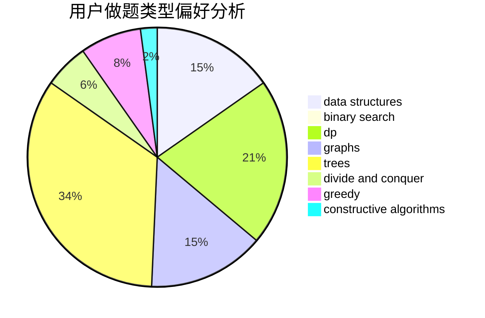

# triccsr

<!-- tabs:start -->

#### **用户提交结果分析**

#### **用户做题类型偏好分析**

#### **用户错题知识点分析**

<!-- tabs:end -->
# 推荐题目
[665D](https://codeforces.com/contest/665/problem/D)		constructive algorithms,
                        greedy,
                        number theory		  
[353A](https://codeforces.com/contest/353/problem/A)		implementation,
                        math		  
[1261F](https://codeforces.com/contest/1261/problem/F)		bitmasks,
                        divide and conquer,
                        math		  
[448C](https://codeforces.com/contest/448/problem/C)		divide and conquer,
                        dp,
                        greedy		  
[402D](https://codeforces.com/contest/402/problem/D)		dp,
                        greedy,
                        math,
                        number theory		  
[737A](https://codeforces.com/contest/737/problem/A)		dsu,graphs,sortings,trees		  
[65A](https://codeforces.com/contest/65/problem/A)		implementation,
                        math		  
[919E](https://codeforces.com/contest/919/problem/E)		chinese remainder theorem,
                        math,
                        number theory		  
[1290B](https://codeforces.com/contest/1290/problem/B)		binary search,
                        constructive algorithms,
                        data structures,
                        strings,
                        two pointers		  
[845G](https://codeforces.com/contest/845/problem/G)		dfs and similar,
                        graphs,
                        math		  
