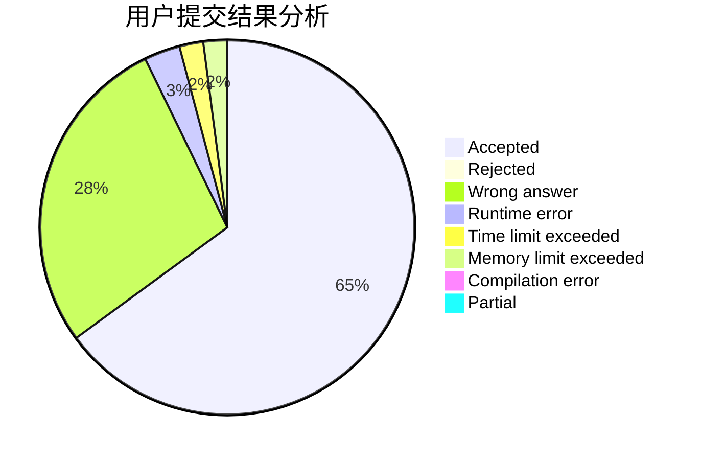
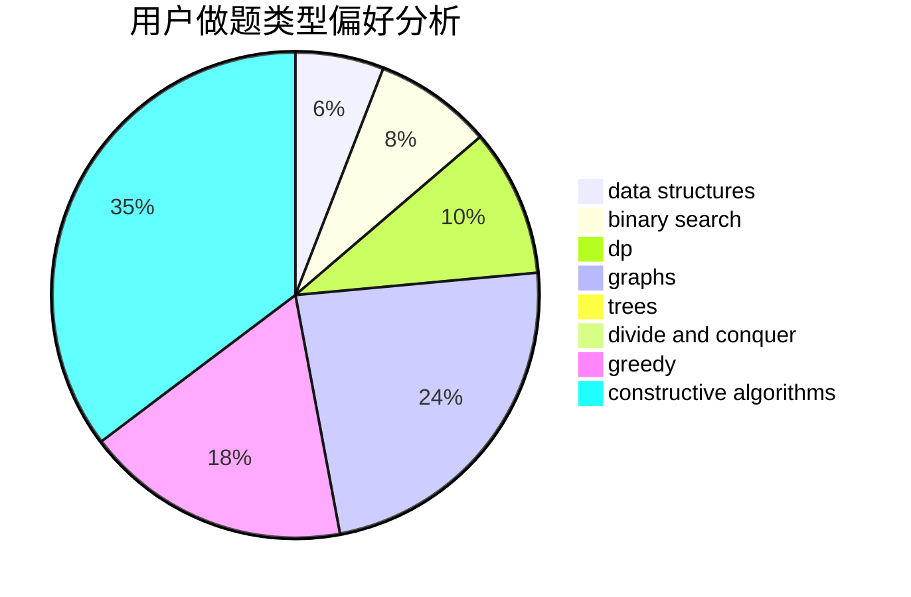

# triccsr

<!-- tabs:start -->

#### **用户提交结果分析**

#### **用户做题类型偏好分析**

#### **用户错题知识点分析**

<!-- tabs:end -->
# 推荐题目
[633B](https://codeforces.com/contest/633/problem/B)		brute force,
                        constructive algorithms,
                        math,
                        number theory		  
[321D](https://codeforces.com/contest/321/problem/D)		dp,
                        greedy,
                        math		  
[1254C](https://codeforces.com/contest/1254/problem/C)		constructive algorithms,
                        geometry,
                        interactive,
                        math		  
[425A](https://codeforces.com/contest/425/problem/A)		brute force,
                        sortings		  
[372D](https://codeforces.com/contest/372/problem/D)		binary search,
                        data structures,
                        dfs and similar,
                        trees,
                        two pointers		  
[71A](https://codeforces.com/contest/71/problem/A)		strings		  
[630A](https://codeforces.com/contest/630/problem/A)		number theory		  
[903E](https://codeforces.com/contest/903/problem/E)		brute force,
                        hashing,
                        implementation,
                        strings		  
[1283B](https://codeforces.com/contest/1283/problem/B)		math		  
[827D](https://codeforces.com/contest/827/problem/D)		data structures,
                        dfs and similar,
                        graphs,
                        trees		  
