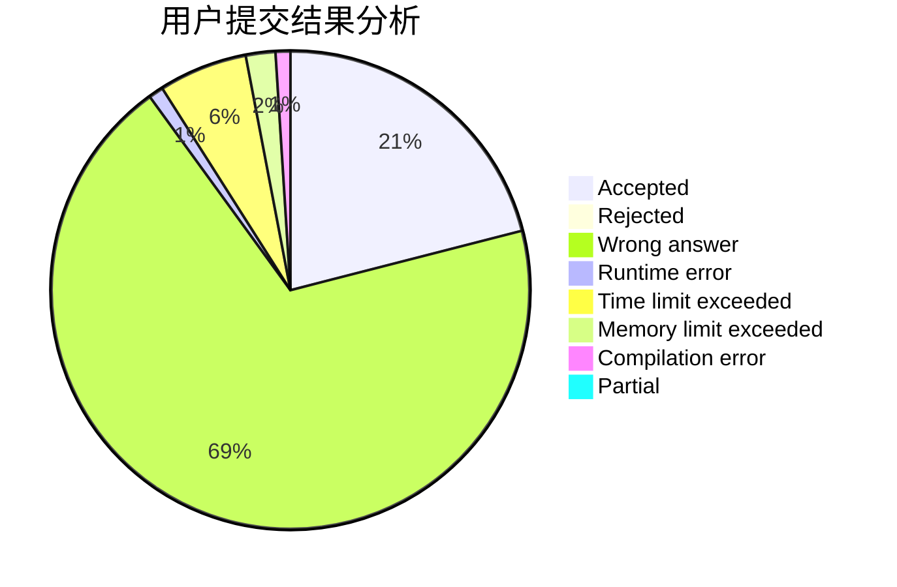
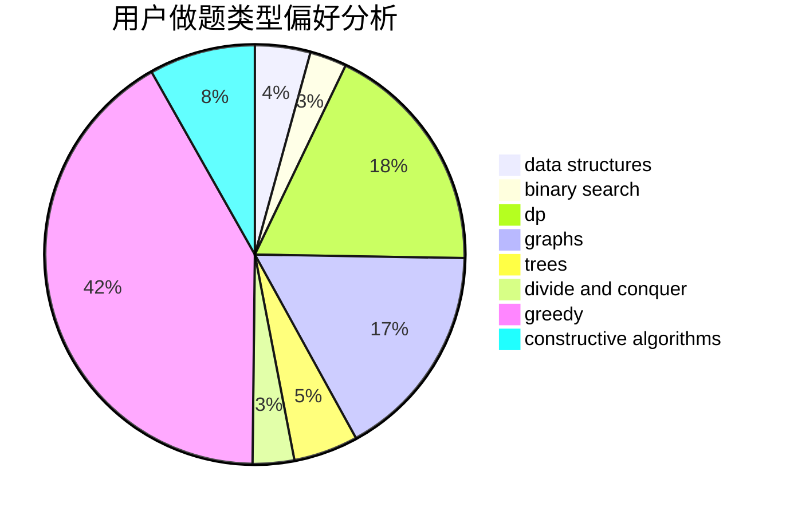
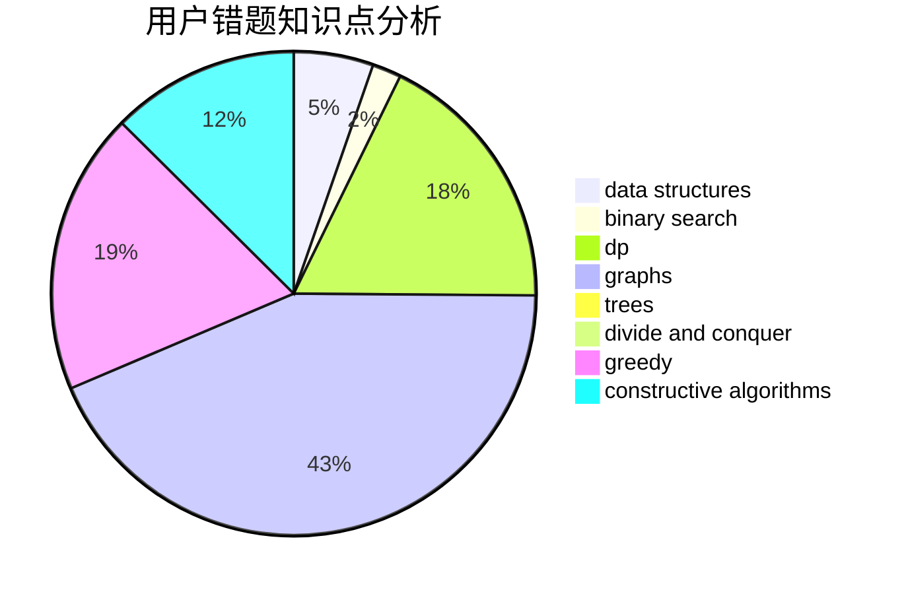

# triple__a

<!-- tabs:start -->

#### **用户提交结果分析**

#### **用户做题类型偏好分析**

#### **用户错题知识点分析**

<!-- tabs:end -->
# 推荐题目
[652E](https://codeforces.com/contest/652/problem/E)		dfs and similar,
                        dsu,
                        graphs,
                        trees		  
[883G](https://codeforces.com/contest/883/problem/G)		dfs and similar,
                        graphs		  
[1013B](https://codeforces.com/contest/1013/problem/B)		greedy		  
[791E](https://codeforces.com/contest/791/problem/E)		dsu,graphs,sortings,trees		  
[1394E](https://codeforces.com/contest/1394/problem/E)		strings		  
[1208B](https://codeforces.com/contest/1208/problem/B)		binary search,
                        brute force,
                        implementation,
                        two pointers		  
[1254B1](https://codeforces.com/contest/1254B/problem/1)		constructive algorithms,
                        greedy,
                        math,
                        number theory,
                        ternary search,
                        two pointers		  
[71B](https://codeforces.com/contest/71/problem/B)		implementation,
                        math		  
[1430F](https://codeforces.com/contest/1430/problem/F)		dp,
                        greedy		  
[1230A](https://codeforces.com/contest/1230/problem/A)		brute force,
                        implementation		  
