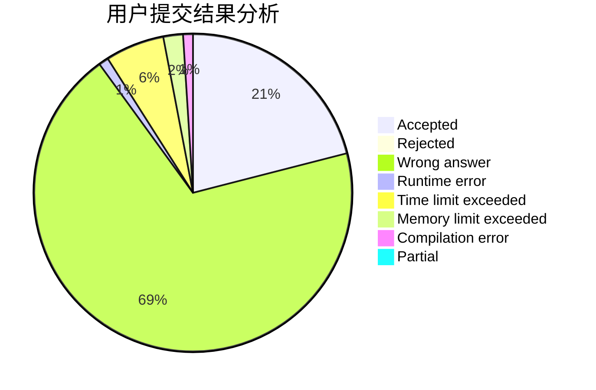
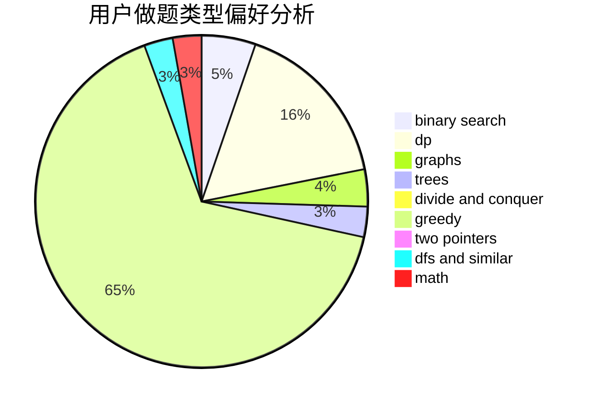

# triple__a

<!-- tabs:start -->

#### **用户提交结果分析**

#### **用户做题类型偏好分析**

<!-- tabs:end -->
# 推荐题目
[676D](https://codeforces.com/contest/676/problem/D)
[901A](https://codeforces.com/contest/901/problem/A)
[1013E](https://codeforces.com/contest/1013/problem/E)
[807C](https://codeforces.com/contest/807/problem/C)
[1403A](https://codeforces.com/contest/1403/problem/A)
[1213F](https://codeforces.com/contest/1213/problem/F)
[1261C](https://codeforces.com/contest/1261/problem/C)
[737B](https://codeforces.com/contest/737/problem/B)
[1439D](https://codeforces.com/contest/1439/problem/D)
[1238E](https://codeforces.com/contest/1238/problem/E)
