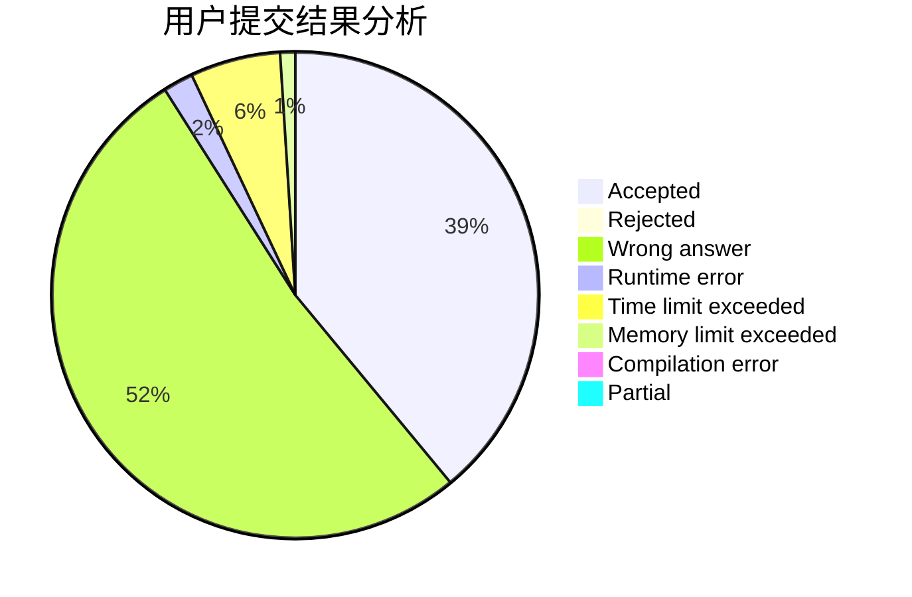
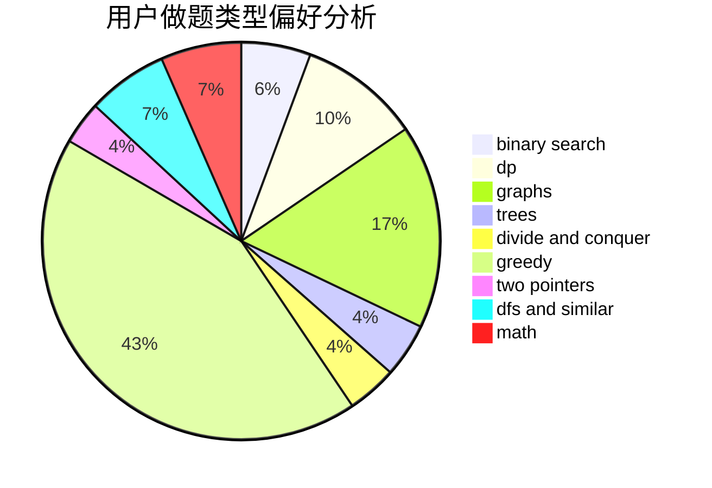

# tsingyawn

<!-- tabs:start -->

#### **用户提交结果分析**

#### **用户做题类型偏好分析**

<!-- tabs:end -->
# 推荐题目
[691D](https://codeforces.com/contest/691/problem/D)
[47B](https://codeforces.com/contest/47/problem/B)
[1419F](https://codeforces.com/contest/1419/problem/F)
[1164M](https://codeforces.com/contest/1164/problem/M)
[1082F](https://codeforces.com/contest/1082/problem/F)
[1003A](https://codeforces.com/contest/1003/problem/A)
[620B](https://codeforces.com/contest/620/problem/B)
[459C](https://codeforces.com/contest/459/problem/C)
[668C](https://codeforces.com/contest/668/problem/C)
[45D](https://codeforces.com/contest/45/problem/D)
