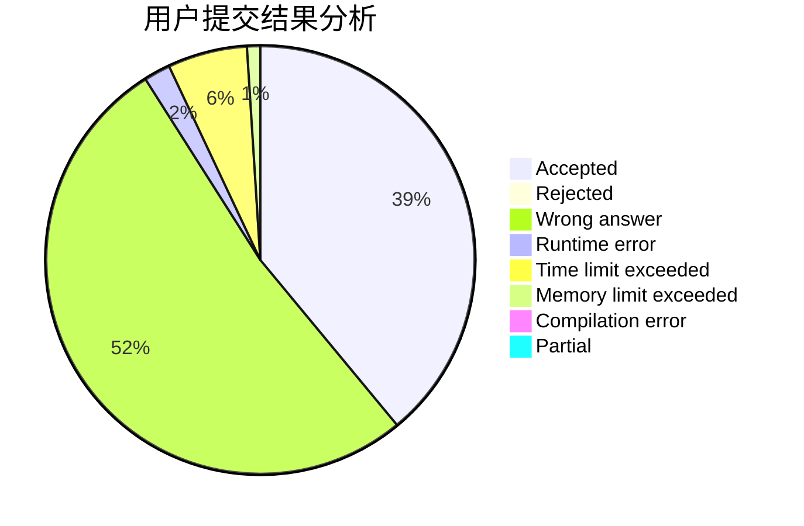
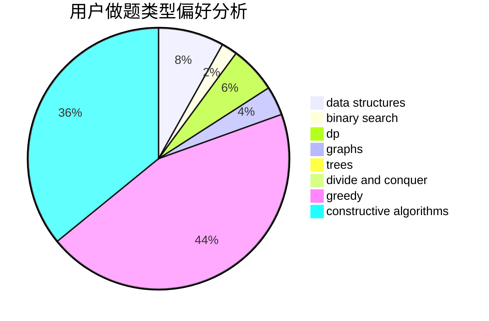

# tsingyawn

<!-- tabs:start -->

#### **用户提交结果分析**

#### **用户做题类型偏好分析**

#### **用户错题知识点分析**

<!-- tabs:end -->
# 推荐题目
[669D](https://codeforces.com/contest/669/problem/D)		dsu,graphs,sortings,trees		  
[460D](https://codeforces.com/contest/460/problem/D)		brute force,
                        constructive algorithms,
                        math		  
[1409A](https://codeforces.com/contest/1409/problem/A)		greedy,
                        math		  
[1162E](https://codeforces.com/contest/1162/problem/E)		dsu,graphs,sortings,trees		  
[1082C](https://codeforces.com/contest/1082/problem/C)		greedy,
                        sortings		  
[1002D3](https://codeforces.com/contest/1002D/problem/3)		nan		  
[600F](https://codeforces.com/contest/600/problem/F)		graphs		  
[437A](https://codeforces.com/contest/437/problem/A)		implementation		  
[638C](https://codeforces.com/contest/638/problem/C)		*special problem,
                        dfs and similar,
                        graphs,
                        greedy,
                        trees		  
[438A](https://codeforces.com/contest/438/problem/A)		dsu,graphs,sortings,trees		  
