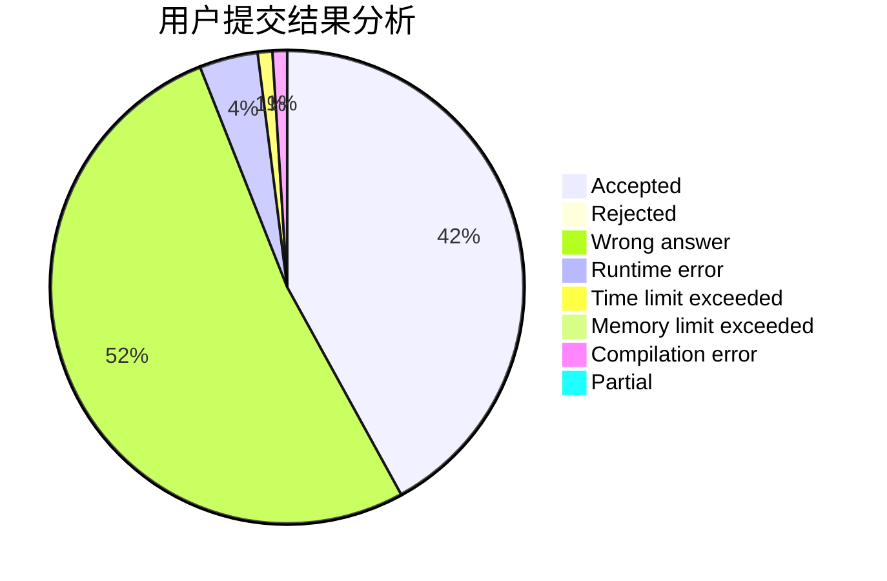
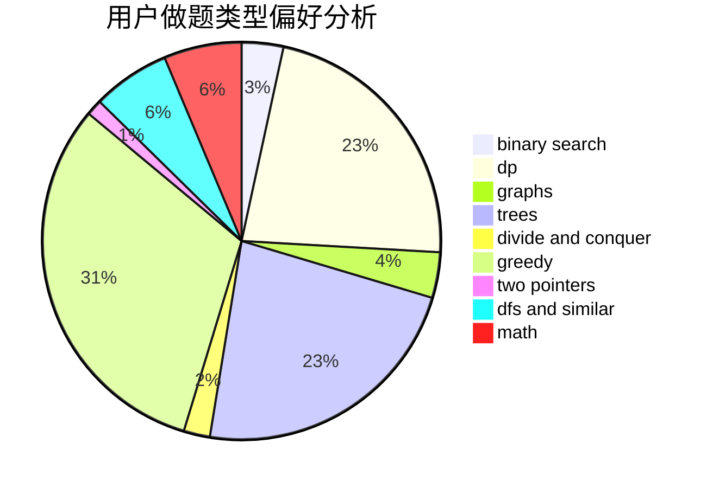

# ttiiaann32

<!-- tabs:start -->

#### **用户提交结果分析**

#### **用户做题类型偏好分析**

<!-- tabs:end -->
# 推荐题目
[1164M](https://codeforces.com/contest/1164/problem/M)
[580D](https://codeforces.com/contest/580/problem/D)
[424A](https://codeforces.com/contest/424/problem/A)
[1310D](https://codeforces.com/contest/1310/problem/D)
[886A](https://codeforces.com/contest/886/problem/A)
[981E](https://codeforces.com/contest/981/problem/E)
[816C](https://codeforces.com/contest/816/problem/C)
[866E](https://codeforces.com/contest/866/problem/E)
[962G](https://codeforces.com/contest/962/problem/G)
[484A](https://codeforces.com/contest/484/problem/A)
