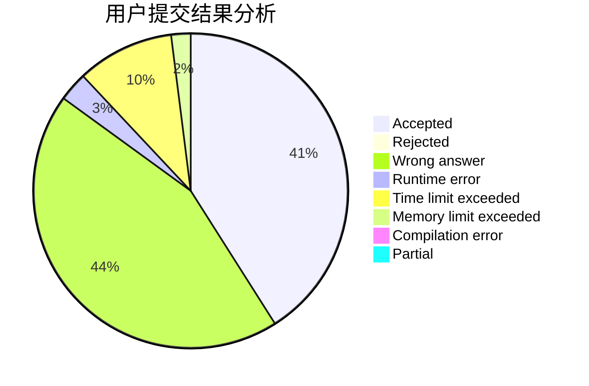
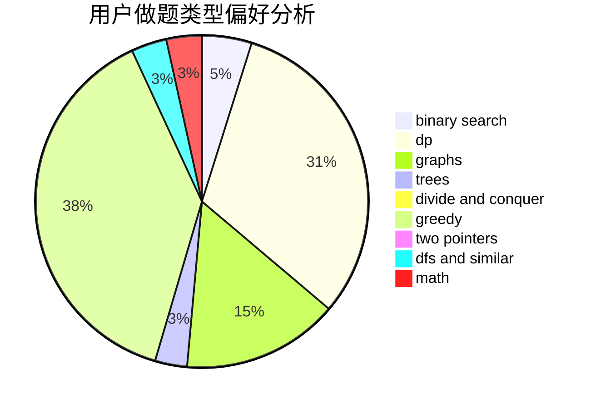

# tudouuuuu

<!-- tabs:start -->

#### **用户提交结果分析**

#### **用户做题类型偏好分析**

<!-- tabs:end -->
# 推荐题目
[804F](https://codeforces.com/contest/804/problem/F)
[1405B](https://codeforces.com/contest/1405/problem/B)
[289D](https://codeforces.com/contest/289/problem/D)
[724C](https://codeforces.com/contest/724/problem/C)
[24E](https://codeforces.com/contest/24/problem/E)
[453D](https://codeforces.com/contest/453/problem/D)
[11961](https://codeforces.com/contest/1196/problem/1)
[97C](https://codeforces.com/contest/97/problem/C)
[596B](https://codeforces.com/contest/596/problem/B)
[1245F](https://codeforces.com/contest/1245/problem/F)
