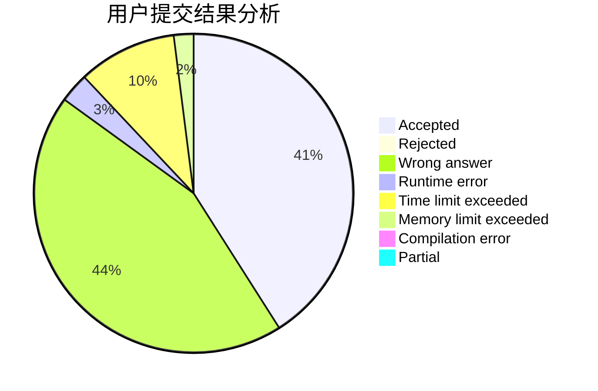
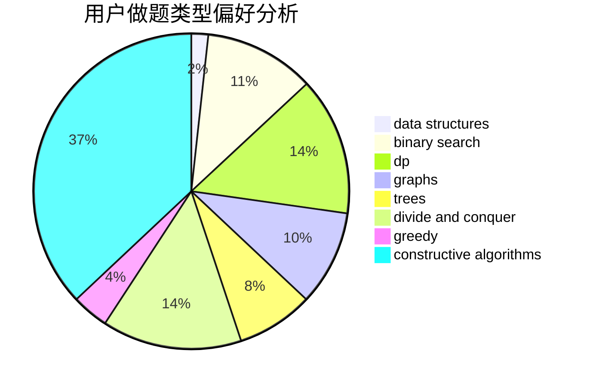
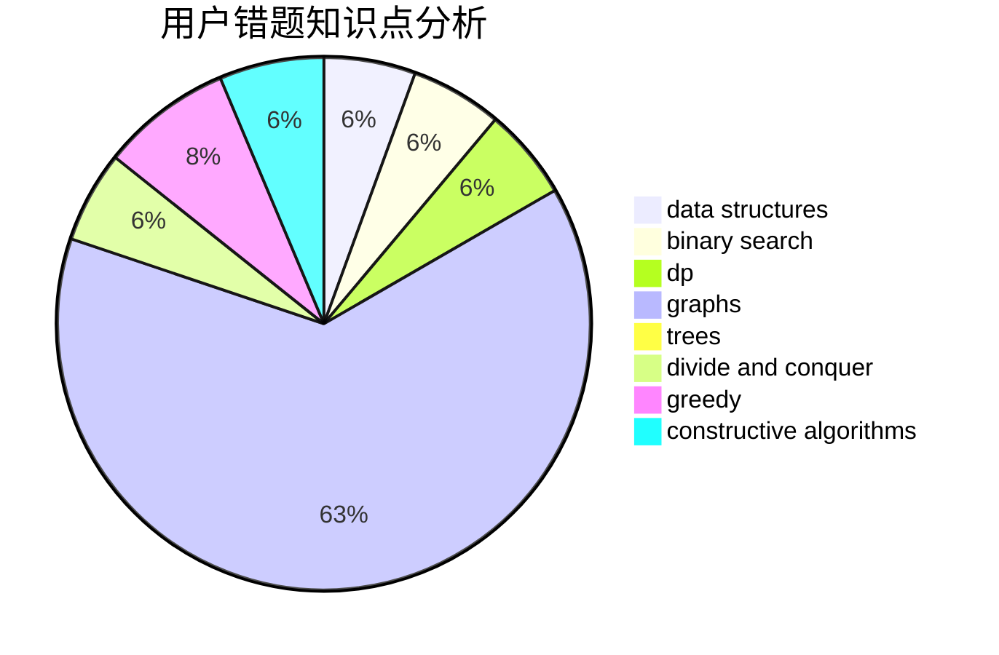

# tudouuuuu

<!-- tabs:start -->

#### **用户提交结果分析**

#### **用户做题类型偏好分析**

#### **用户错题知识点分析**

<!-- tabs:end -->
# 推荐题目
[789D](https://codeforces.com/contest/789/problem/D)		dsu,graphs,sortings,trees		  
[1396C](https://codeforces.com/contest/1396/problem/C)		dp,
                        greedy,
                        implementation		  
[273E](https://codeforces.com/contest/273/problem/E)		dp,
                        games		  
[705B](https://codeforces.com/contest/705/problem/B)		games,
                        math		  
[22B](https://codeforces.com/contest/22/problem/B)		brute force,
                        dp		  
[432D](https://codeforces.com/contest/432/problem/D)		dp,
                        string suffix structures,
                        strings,
                        two pointers		  
[1190A](https://codeforces.com/contest/1190/problem/A)		implementation,
                        two pointers		  
[958C3](https://codeforces.com/contest/958C/problem/3)		data structures,
                        dp		  
[575B](https://codeforces.com/contest/575/problem/B)		dfs and similar,
                        graphs,
                        trees		  
[1240C](https://codeforces.com/contest/1240/problem/C)		dsu,graphs,sortings,trees		  
