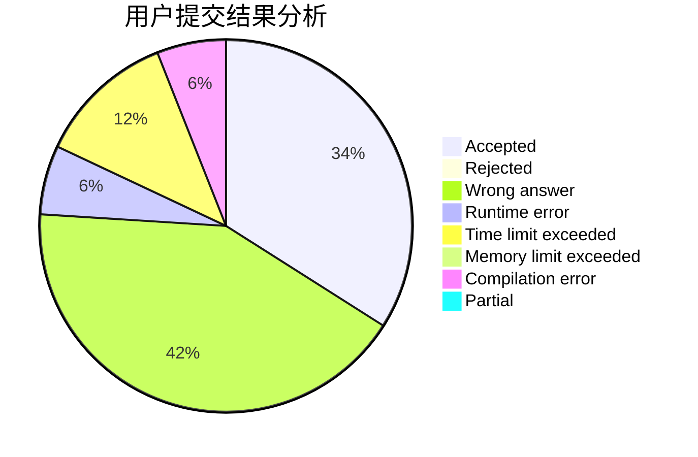
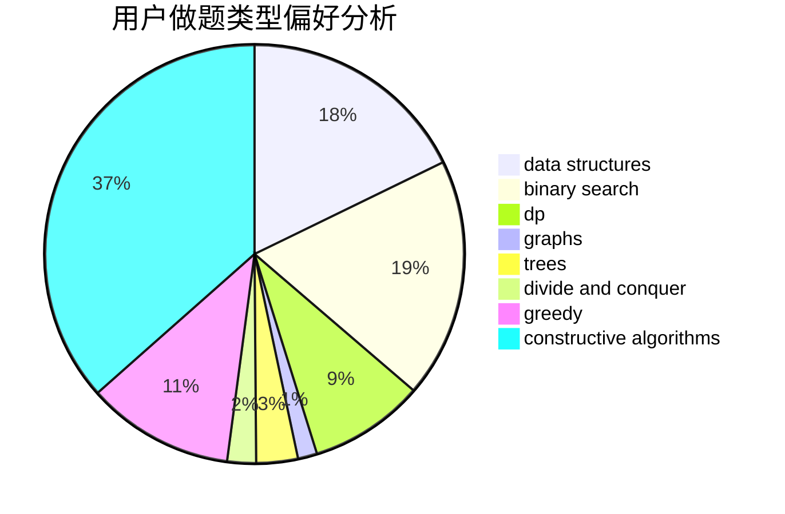
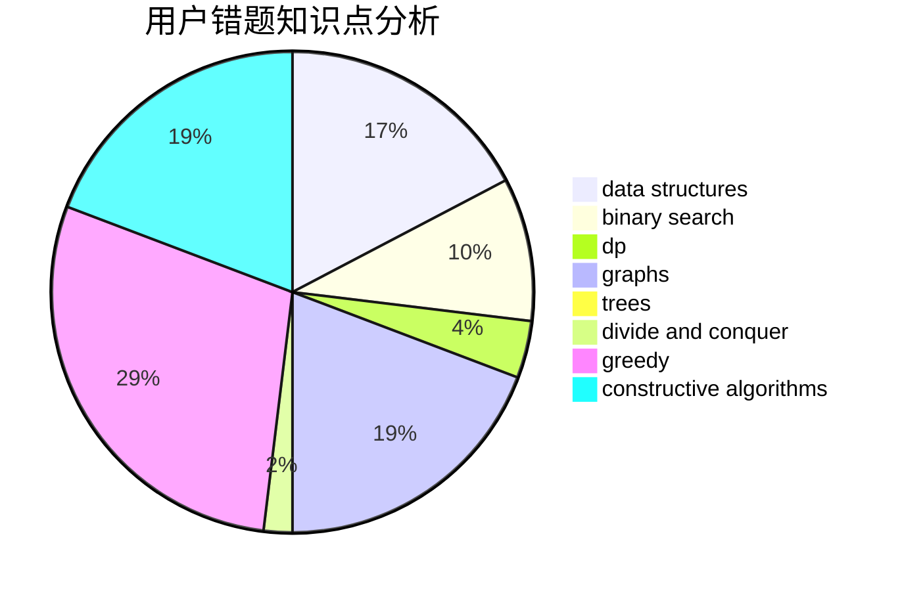

# CWHer

<!-- tabs:start -->

#### **用户提交结果分析**

#### **用户做题类型偏好分析**

#### **用户错题知识点分析**

<!-- tabs:end -->
# 推荐题目
[385E](https://codeforces.com/contest/385/problem/E)		math,
                        matrices		  
[276D](https://codeforces.com/contest/276/problem/D)		bitmasks,
                        dp,
                        greedy,
                        implementation,
                        math		  
[1509F](https://codeforces.com/contest/1509/problem/F)		dsu,graphs,sortings,trees		  
[620C](https://codeforces.com/contest/620/problem/C)		greedy		  
[588B](https://codeforces.com/contest/588/problem/B)		math		  
[620B](https://codeforces.com/contest/620/problem/B)		implementation		  
[43A](https://codeforces.com/contest/43/problem/A)		strings		  
[300C](https://codeforces.com/contest/300/problem/C)		brute force,
                        combinatorics		  
[61A](https://codeforces.com/contest/61/problem/A)		implementation		  
[1248C](https://codeforces.com/contest/1248/problem/C)		dsu,graphs,sortings,trees		  
