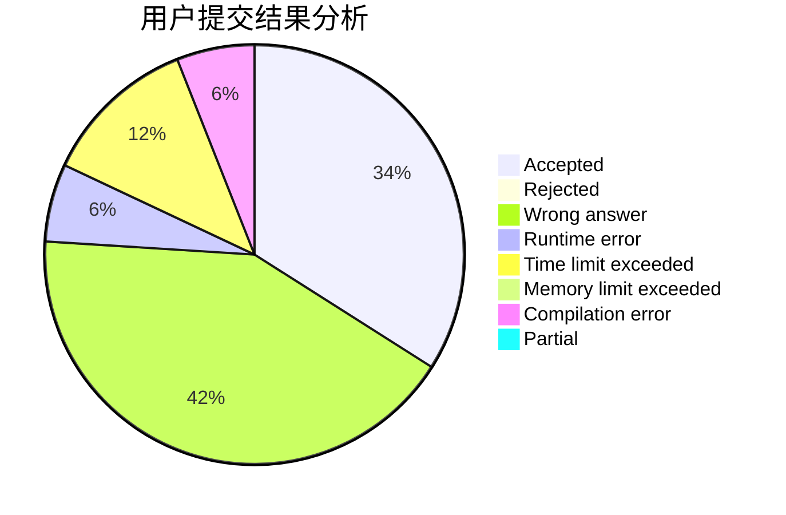
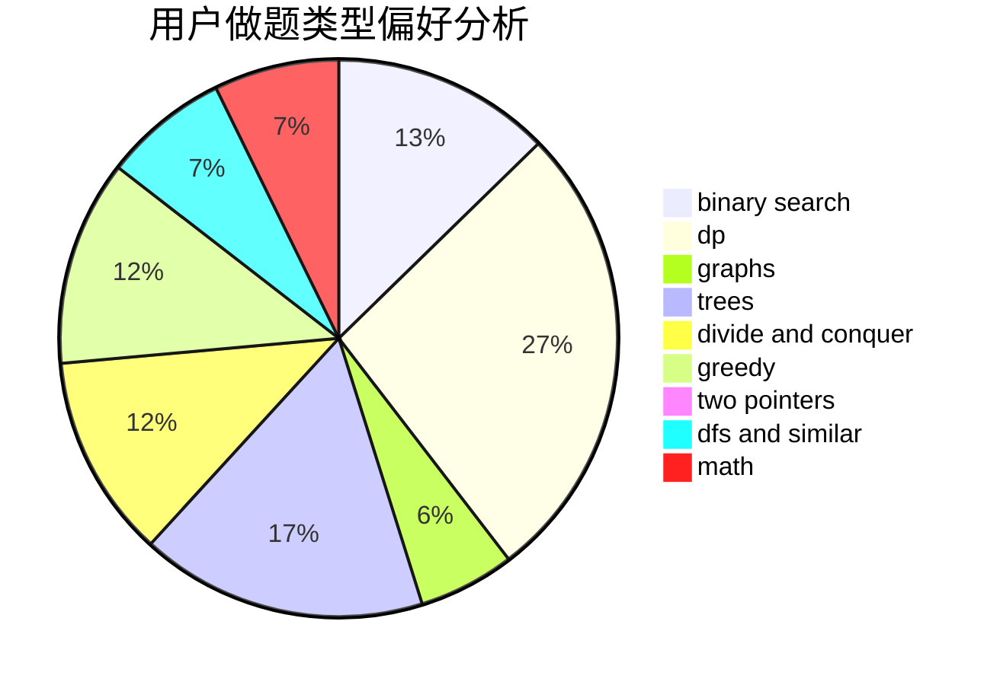

# CWHer

<!-- tabs:start -->

#### **用户提交结果分析**

#### **用户做题类型偏好分析**

<!-- tabs:end -->
# 推荐题目
[415A](https://codeforces.com/contest/415/problem/A)
[291A](https://codeforces.com/contest/291/problem/A)
[160D](https://codeforces.com/contest/160/problem/D)
[643F](https://codeforces.com/contest/643/problem/F)
[608D](https://codeforces.com/contest/608/problem/D)
[643E](https://codeforces.com/contest/643/problem/E)
[461B](https://codeforces.com/contest/461/problem/B)
[319A](https://codeforces.com/contest/319/problem/A)
[63C](https://codeforces.com/contest/63/problem/C)
[1252D](https://codeforces.com/contest/1252/problem/D)
