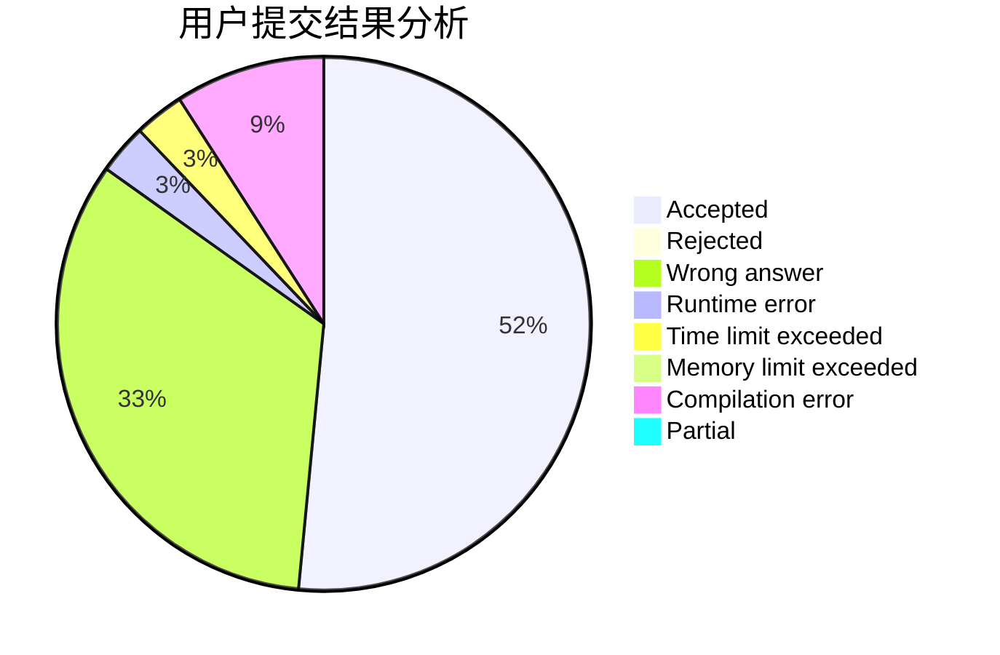
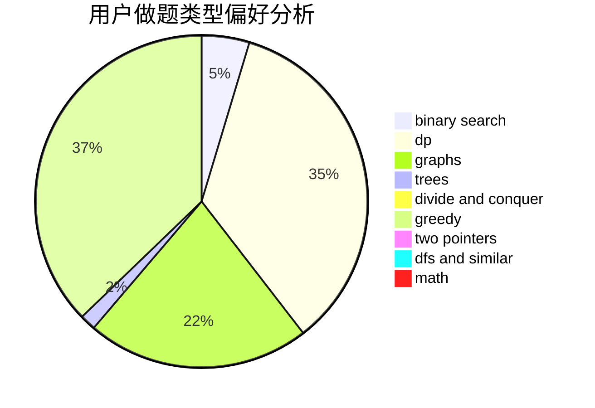

# tuihuademing5

<!-- tabs:start -->

#### **用户提交结果分析**

#### **用户做题类型偏好分析**

<!-- tabs:end -->
# 推荐题目
[1499G](https://codeforces.com/contest/1499/problem/G)
[1077D](https://codeforces.com/contest/1077/problem/D)
[1191A](https://codeforces.com/contest/1191/problem/A)
[464B](https://codeforces.com/contest/464/problem/B)
[1263E](https://codeforces.com/contest/1263/problem/E)
[1257E](https://codeforces.com/contest/1257/problem/E)
[1334B](https://codeforces.com/contest/1334/problem/B)
[268C](https://codeforces.com/contest/268/problem/C)
[148D](https://codeforces.com/contest/148/problem/D)
[1490C](https://codeforces.com/contest/1490/problem/C)
