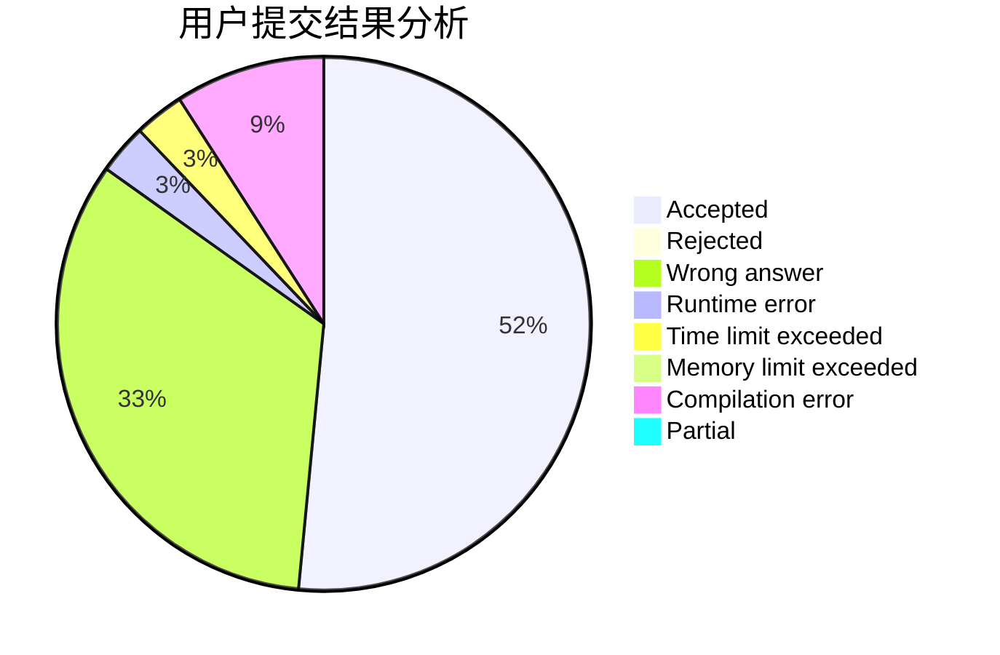
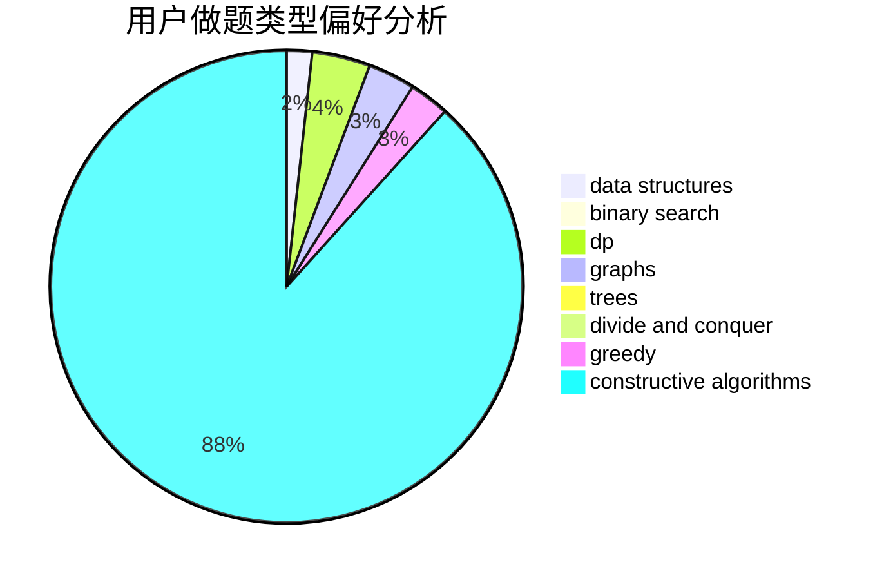
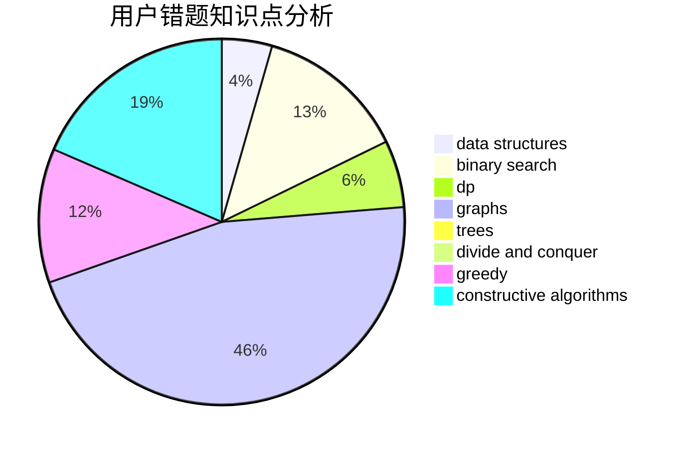

# tuihuademing5

<!-- tabs:start -->

#### **用户提交结果分析**

#### **用户做题类型偏好分析**

#### **用户错题知识点分析**

<!-- tabs:end -->
# 推荐题目
[1499G](https://codeforces.com/contest/1499/problem/G)		data structures,
                        graphs,
                        interactive		  
[1077D](https://codeforces.com/contest/1077/problem/D)		binary search,
                        sortings		  
[1191A](https://codeforces.com/contest/1191/problem/A)		brute force		  
[464B](https://codeforces.com/contest/464/problem/B)		brute force,
                        geometry		  
[1263E](https://codeforces.com/contest/1263/problem/E)		data structures,
                        implementation		  
[1257E](https://codeforces.com/contest/1257/problem/E)		data structures,
                        dp,
                        greedy		  
[1334B](https://codeforces.com/contest/1334/problem/B)		greedy,
                        sortings		  
[268C](https://codeforces.com/contest/268/problem/C)		constructive algorithms,
                        implementation		  
[148D](https://codeforces.com/contest/148/problem/D)		dp,
                        games,
                        math,
                        probabilities		  
[1490C](https://codeforces.com/contest/1490/problem/C)		binary search,
                        brute force,
                        brute force,
                        math		  
