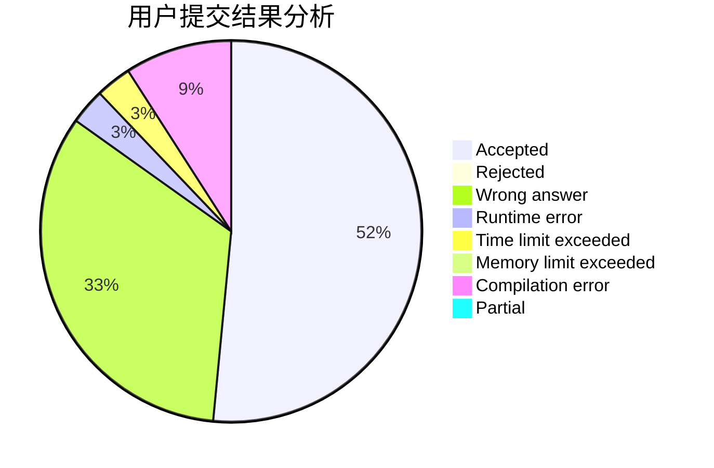
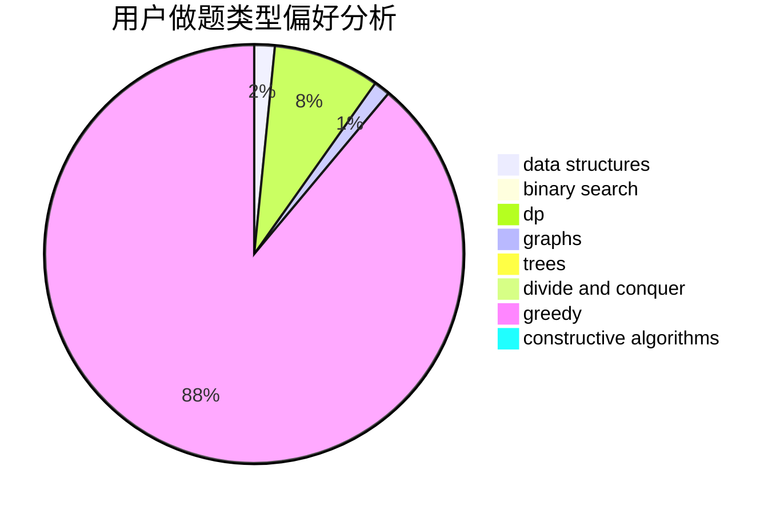
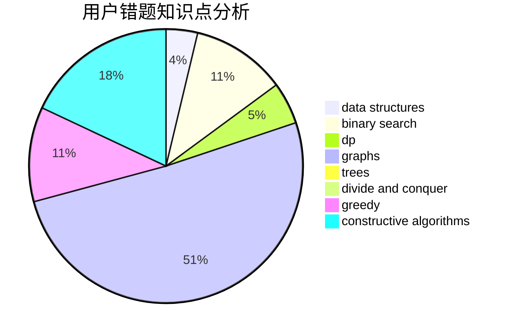

# tuihuademing5

<!-- tabs:start -->

#### **用户提交结果分析**

#### **用户做题类型偏好分析**

#### **用户错题知识点分析**

<!-- tabs:end -->
# 推荐题目
[1491A](https://codeforces.com/contest/1491/problem/A)		brute force,
                        greedy,
                        implementation		  
[1077C](https://codeforces.com/contest/1077/problem/C)		nan		  
[1187D](https://codeforces.com/contest/1187/problem/D)		data structures,
                        sortings		  
[444C](https://codeforces.com/contest/444/problem/C)		data structures		  
[1256C](https://codeforces.com/contest/1256/problem/C)		greedy		  
[1252D](https://codeforces.com/contest/1252/problem/D)		data structures,
                        dp,
                        strings,
                        trees		  
[1327E](https://codeforces.com/contest/1327/problem/E)		combinatorics,
                        dp,
                        math		  
[249E](https://codeforces.com/contest/249/problem/E)		math		  
[1482A](https://codeforces.com/contest/1482/problem/A)		math		  
[1482E](https://codeforces.com/contest/1482/problem/E)		data structures,
                        divide and conquer,
                        dp		  
