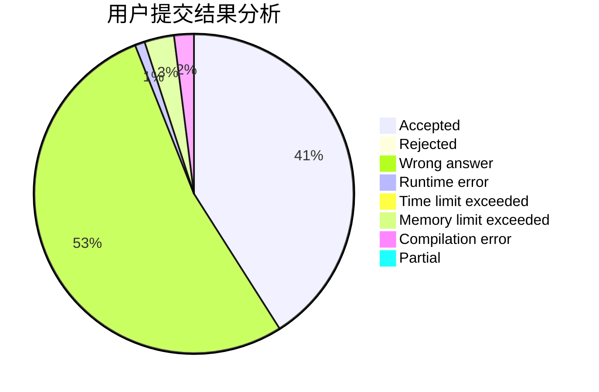
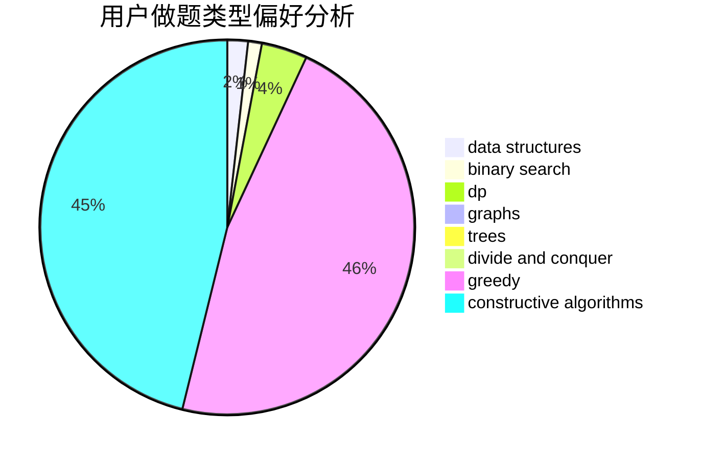

# tulerfeng

<!-- tabs:start -->

#### **用户提交结果分析**

#### **用户做题类型偏好分析**

#### **用户错题知识点分析**

<!-- tabs:end -->
# 推荐题目
[1220C](https://codeforces.com/contest/1220/problem/C)		games,
                        greedy,
                        strings		  
[902B](https://codeforces.com/contest/902/problem/B)		dfs and similar,
                        dsu,
                        greedy		  
[448D](https://codeforces.com/contest/448/problem/D)		binary search,
                        brute force		  
[864F](https://codeforces.com/contest/864/problem/F)		dfs and similar,
                        graphs,
                        trees		  
[1382B](https://codeforces.com/contest/1382/problem/B)		dp,
                        games		  
[234C](https://codeforces.com/contest/234/problem/C)		dp,
                        implementation		  
[1361C](https://codeforces.com/contest/1361/problem/C)		binary search,
                        bitmasks,
                        constructive algorithms,
                        dfs and similar,
                        dsu,
                        graphs		  
[12162](https://codeforces.com/contest/1216/problem/2)		dsu,graphs,sortings,trees		  
[736A](https://codeforces.com/contest/736/problem/A)		dsu,graphs,sortings,trees		  
[97E](https://codeforces.com/contest/97/problem/E)		dfs and similar,
                        dsu,
                        graphs,
                        trees		  
