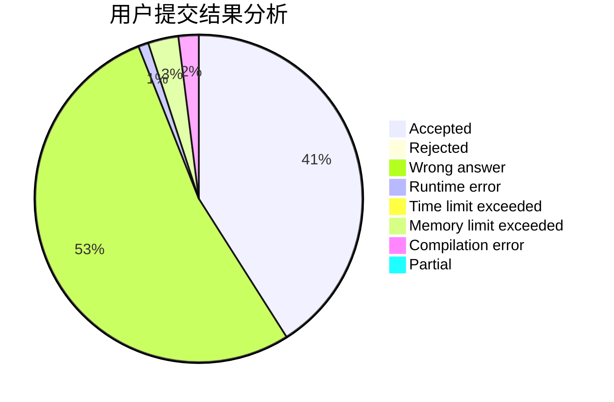
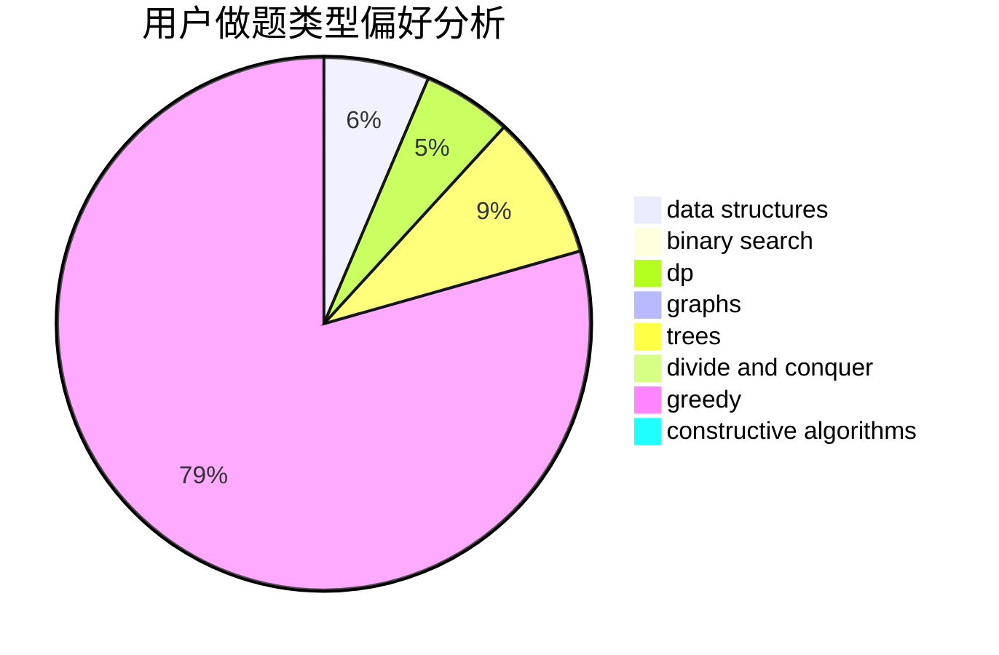

# tulerfeng

<!-- tabs:start -->

#### **用户提交结果分析**

#### **用户做题类型偏好分析**

#### **用户错题知识点分析**

<!-- tabs:end -->
# 推荐题目
[1214G](https://codeforces.com/contest/1214/problem/G)		bitmasks,
                        data structures		  
[884A](https://codeforces.com/contest/884/problem/A)		implementation		  
[425B](https://codeforces.com/contest/425/problem/B)		bitmasks,
                        greedy		  
[846E](https://codeforces.com/contest/846/problem/E)		dfs and similar,
                        greedy,
                        trees		  
[1373F](https://codeforces.com/contest/1373/problem/F)		binary search,
                        constructive algorithms,
                        data structures,
                        greedy		  
[215C](https://codeforces.com/contest/215/problem/C)		brute force,
                        implementation		  
[1354F](https://codeforces.com/contest/1354/problem/F)		constructive algorithms,
                        dp,
                        flows,
                        graph matchings,
                        greedy,
                        sortings		  
[120H](https://codeforces.com/contest/120/problem/H)		graph matchings		  
[718E](https://codeforces.com/contest/718/problem/E)		bitmasks,
                        graphs		  
[958E1](https://codeforces.com/contest/958E/problem/1)		brute force,
                        geometry,
                        greedy,
                        math		  
