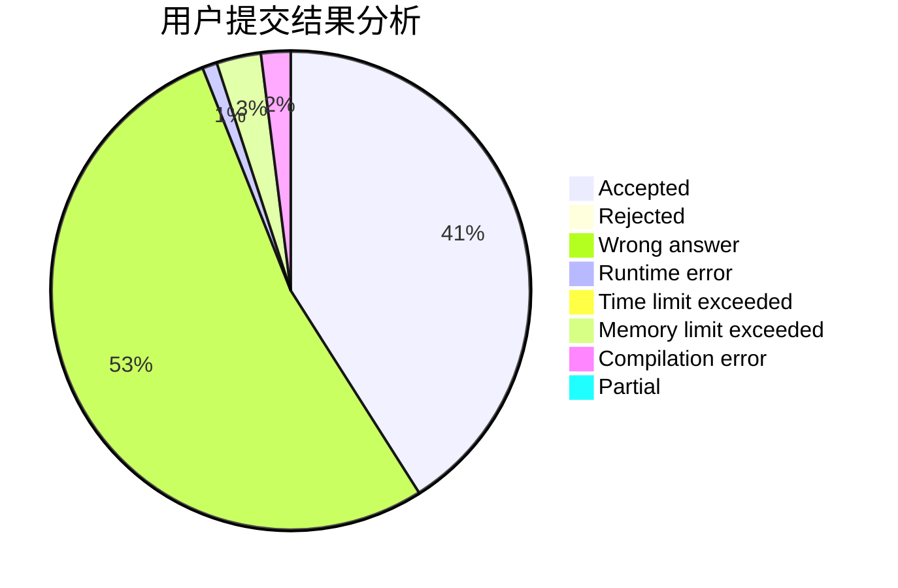
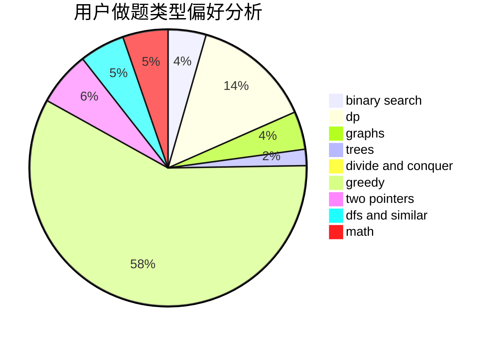

# tulerfeng

<!-- tabs:start -->

#### **用户提交结果分析**

#### **用户做题类型偏好分析**

<!-- tabs:end -->
# 推荐题目
[1220C](https://codeforces.com/contest/1220/problem/C)
[902B](https://codeforces.com/contest/902/problem/B)
[448D](https://codeforces.com/contest/448/problem/D)
[864F](https://codeforces.com/contest/864/problem/F)
[1382B](https://codeforces.com/contest/1382/problem/B)
[234C](https://codeforces.com/contest/234/problem/C)
[1361C](https://codeforces.com/contest/1361/problem/C)
[12162](https://codeforces.com/contest/1216/problem/2)
[736A](https://codeforces.com/contest/736/problem/A)
[97E](https://codeforces.com/contest/97/problem/E)
