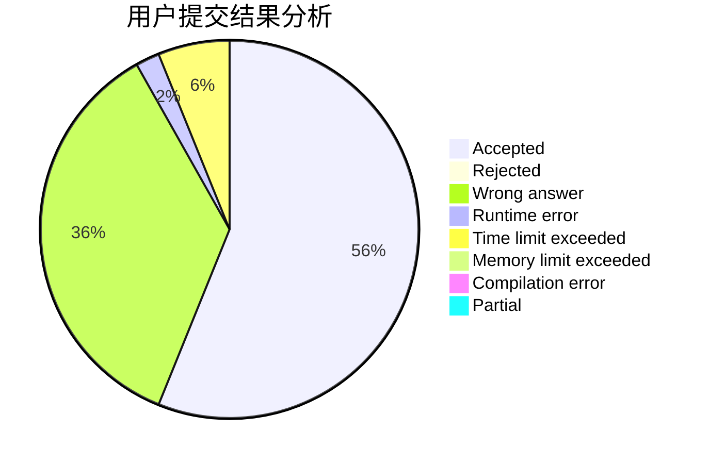
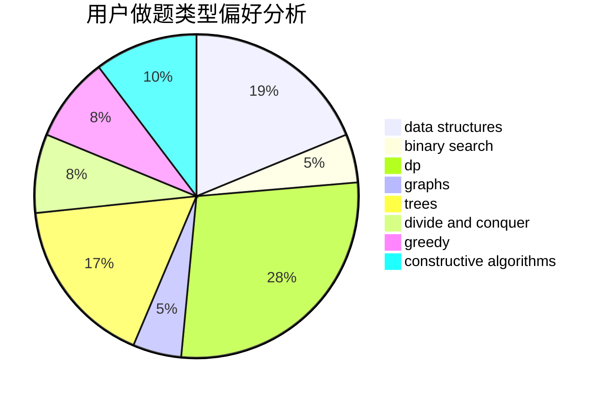
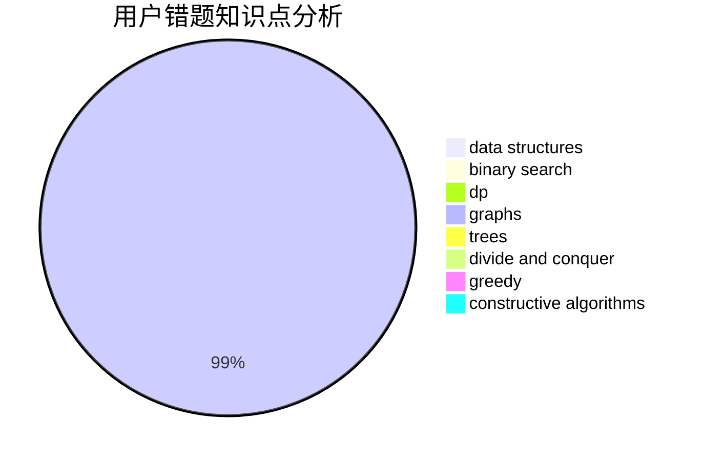

# tyakennikku

<!-- tabs:start -->

#### **用户提交结果分析**

#### **用户做题类型偏好分析**

#### **用户错题知识点分析**

<!-- tabs:end -->
# 推荐题目
[14472](https://codeforces.com/contest/1447/problem/2)		dsu,graphs,sortings,trees		  
[304C](https://codeforces.com/contest/304/problem/C)		dsu,graphs,sortings,trees		  
[551B](https://codeforces.com/contest/551/problem/B)		brute force,
                        constructive algorithms,
                        implementation,
                        strings		  
[691D](https://codeforces.com/contest/691/problem/D)		dfs and similar,
                        dsu,
                        math		  
[784C](https://codeforces.com/contest/784/problem/C)		*special problem,
                        implementation		  
[273D](https://codeforces.com/contest/273/problem/D)		dp		  
[218C](https://codeforces.com/contest/218/problem/C)		dsu,graphs,sortings,trees		  
[622C](https://codeforces.com/contest/622/problem/C)		data structures,
                        implementation		  
[1218C](https://codeforces.com/contest/1218/problem/C)		dp		  
[903G](https://codeforces.com/contest/903/problem/G)		data structures,
                        flows,
                        graphs		  
