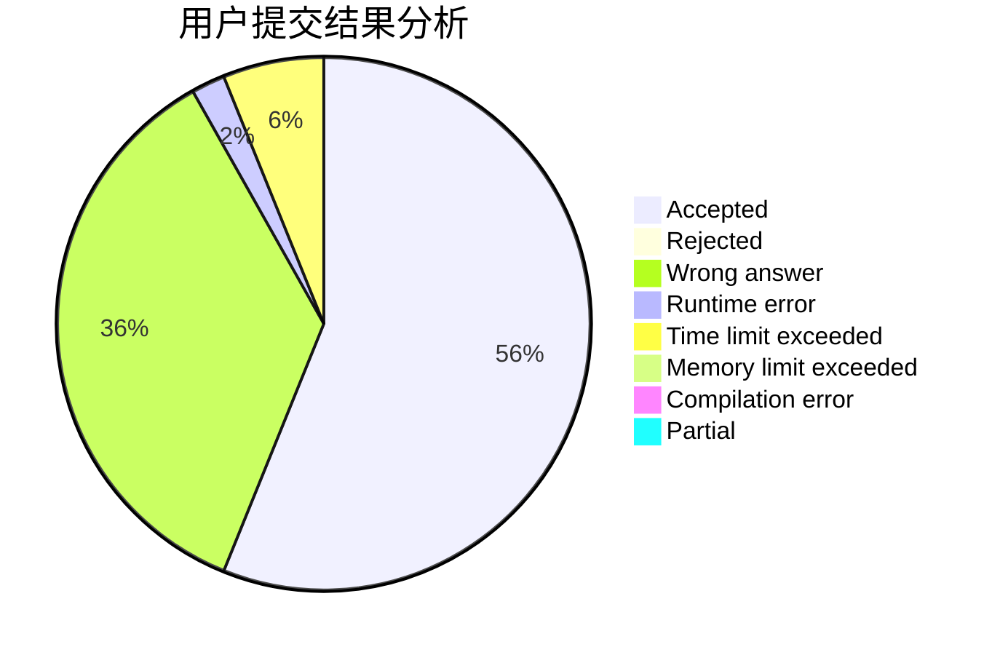
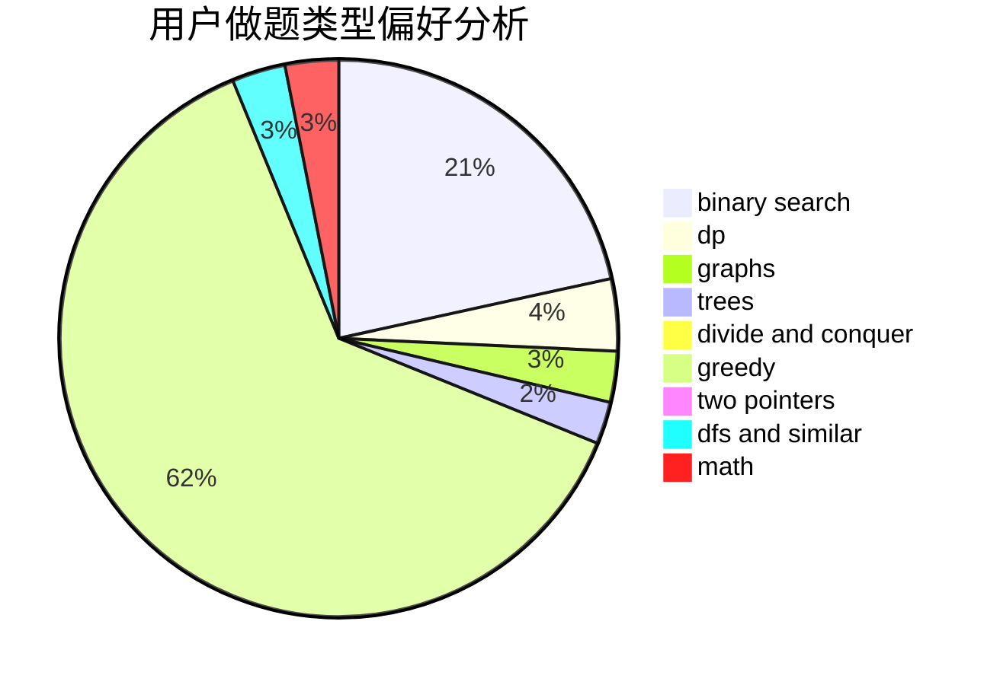

# tyakennikku

<!-- tabs:start -->

#### **用户提交结果分析**

#### **用户做题类型偏好分析**

<!-- tabs:end -->
# 推荐题目
[14472](https://codeforces.com/contest/1447/problem/2)
[304C](https://codeforces.com/contest/304/problem/C)
[551B](https://codeforces.com/contest/551/problem/B)
[691D](https://codeforces.com/contest/691/problem/D)
[784C](https://codeforces.com/contest/784/problem/C)
[273D](https://codeforces.com/contest/273/problem/D)
[218C](https://codeforces.com/contest/218/problem/C)
[622C](https://codeforces.com/contest/622/problem/C)
[1218C](https://codeforces.com/contest/1218/problem/C)
[903G](https://codeforces.com/contest/903/problem/G)
