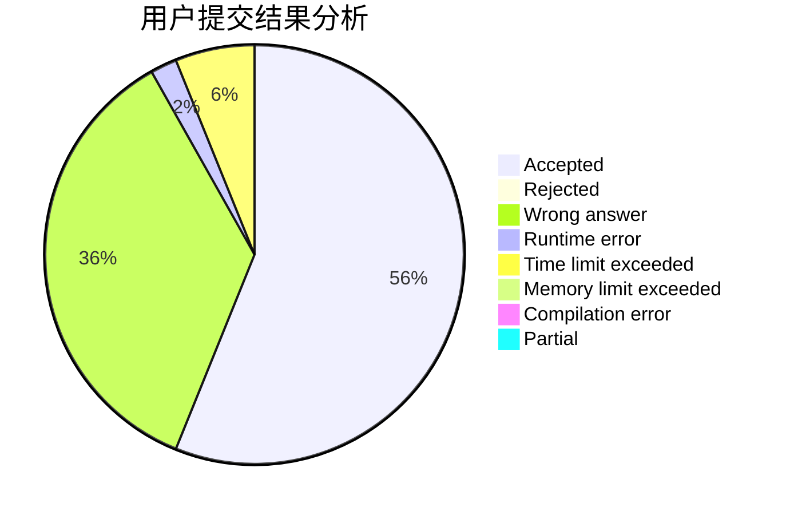
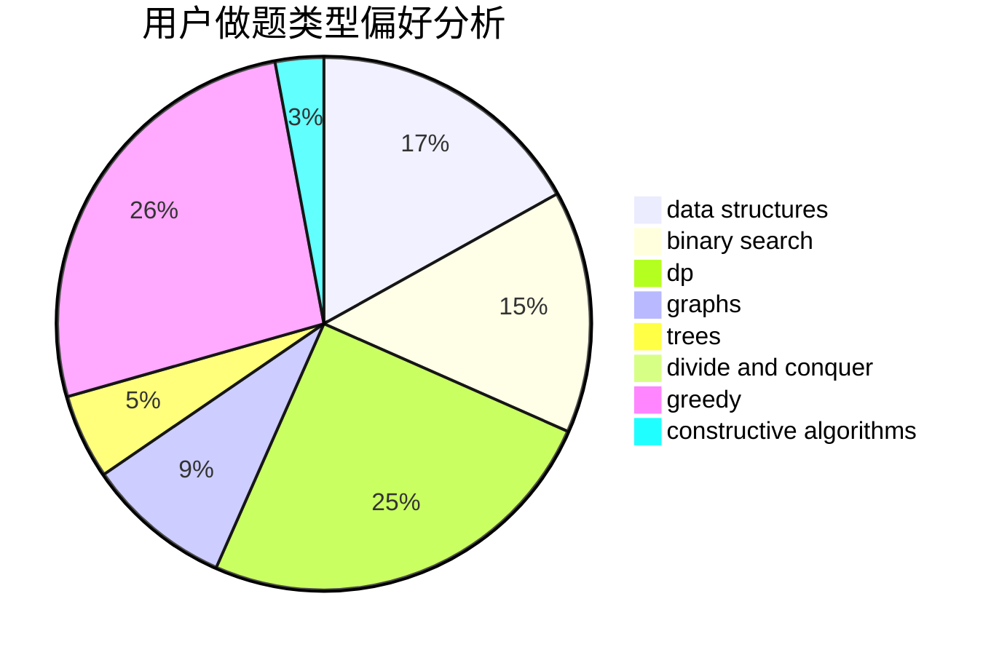
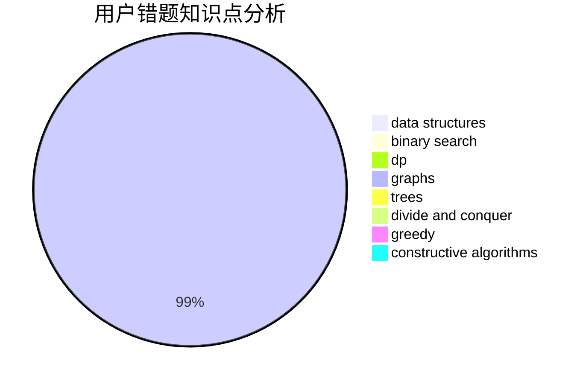

# tyakennikku

<!-- tabs:start -->

#### **用户提交结果分析**

#### **用户做题类型偏好分析**

#### **用户错题知识点分析**

<!-- tabs:end -->
# 推荐题目
[1437C](https://codeforces.com/contest/1437/problem/C)		dp,
                        flows,
                        graph matchings,
                        greedy,
                        math,
                        sortings		  
[28C](https://codeforces.com/contest/28/problem/C)		combinatorics,
                        dp,
                        probabilities		  
[527B](https://codeforces.com/contest/527/problem/B)		greedy		  
[669D](https://codeforces.com/contest/669/problem/D)		dsu,graphs,sortings,trees		  
[764E](https://codeforces.com/contest/764/problem/E)		dsu,graphs,sortings,trees		  
[254D](https://codeforces.com/contest/254/problem/D)		brute force,
                        dfs and similar,
                        graphs,
                        implementation,
                        shortest paths		  
[195C](https://codeforces.com/contest/195/problem/C)		expression parsing,
                        implementation		  
[604A](https://codeforces.com/contest/604/problem/A)		implementation		  
[1213D2](https://codeforces.com/contest/1213D/problem/2)		brute force,
                        math,
                        sortings		  
[886E](https://codeforces.com/contest/886/problem/E)		combinatorics,
                        dp,
                        math		  
