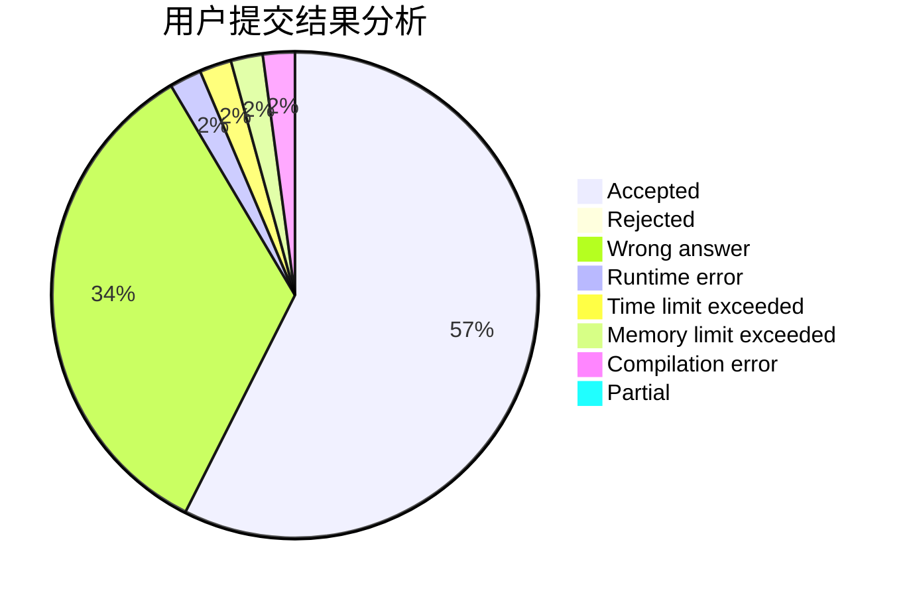
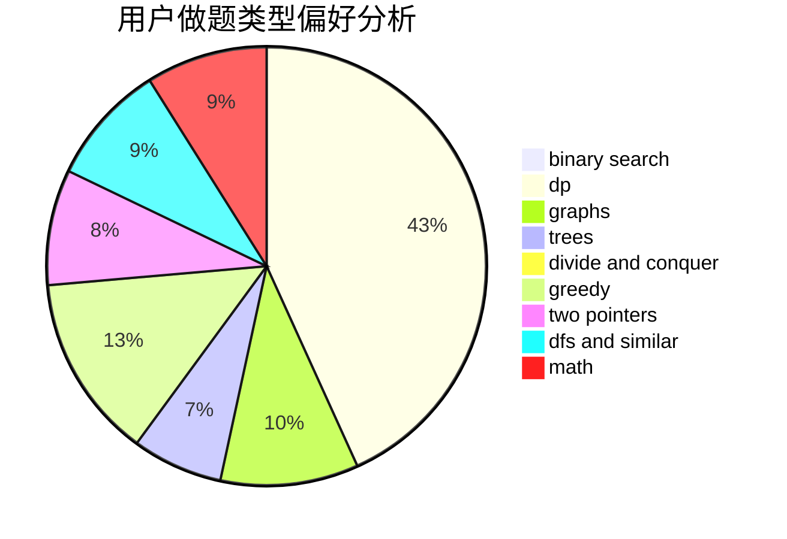

# tzc__wk

<!-- tabs:start -->

#### **用户提交结果分析**

#### **用户做题类型偏好分析**

<!-- tabs:end -->
# 推荐题目
[260D](https://codeforces.com/contest/260/problem/D)
[1469E](https://codeforces.com/contest/1469/problem/E)
[1151D](https://codeforces.com/contest/1151/problem/D)
[798E](https://codeforces.com/contest/798/problem/E)
[1155A](https://codeforces.com/contest/1155/problem/A)
[455B](https://codeforces.com/contest/455/problem/B)
[802A](https://codeforces.com/contest/802/problem/A)
[1230E](https://codeforces.com/contest/1230/problem/E)
[714E](https://codeforces.com/contest/714/problem/E)
[1155D](https://codeforces.com/contest/1155/problem/D)
