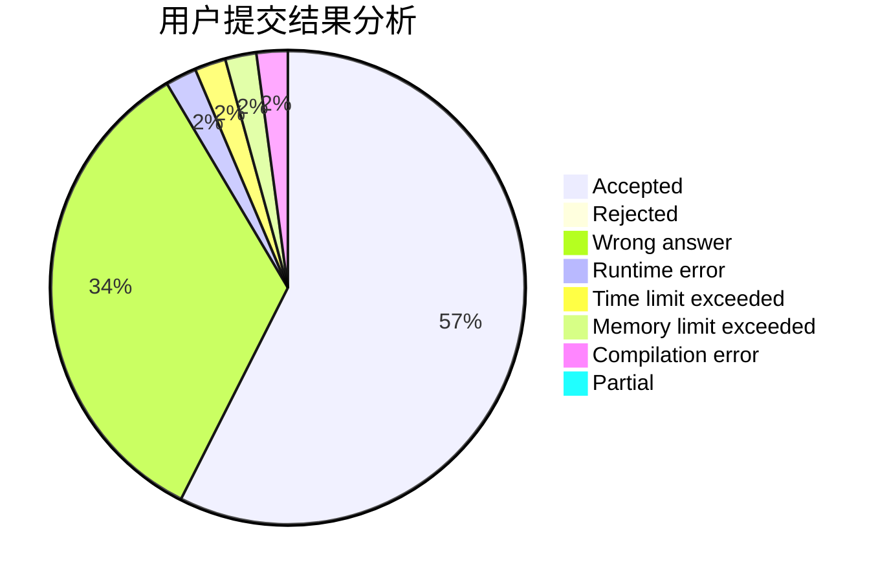
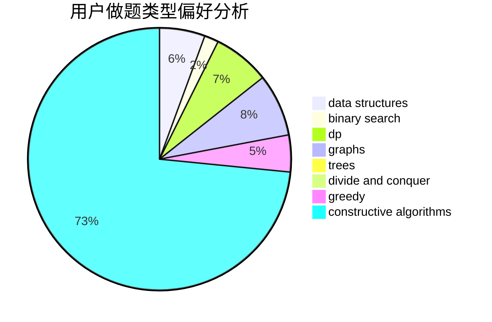

# tzc__wk

<!-- tabs:start -->

#### **用户提交结果分析**

#### **用户做题类型偏好分析**

#### **用户错题知识点分析**

<!-- tabs:end -->
# 推荐题目
[23B](https://codeforces.com/contest/23/problem/B)		constructive algorithms,
                        graphs,
                        math		  
[1462C](https://codeforces.com/contest/1462/problem/C)		brute force,
                        greedy,
                        math		  
[114A](https://codeforces.com/contest/114/problem/A)		math		  
[780B](https://codeforces.com/contest/780/problem/B)		binary search		  
[1153A](https://codeforces.com/contest/1153/problem/A)		brute force,
                        math		  
[434C](https://codeforces.com/contest/434/problem/C)		dsu,graphs,sortings,trees		  
[784E](https://codeforces.com/contest/784/problem/E)		*special problem,
                        brute force,
                        implementation		  
[1223F](https://codeforces.com/contest/1223/problem/F)		data structures,
                        divide and conquer,
                        dp,
                        hashing		  
[698B](https://codeforces.com/contest/698/problem/B)		constructive algorithms,
                        dfs and similar,
                        dsu,
                        graphs,
                        trees		  
[1153D](https://codeforces.com/contest/1153/problem/D)		binary search,
                        dfs and similar,
                        dp,
                        greedy,
                        trees		  
