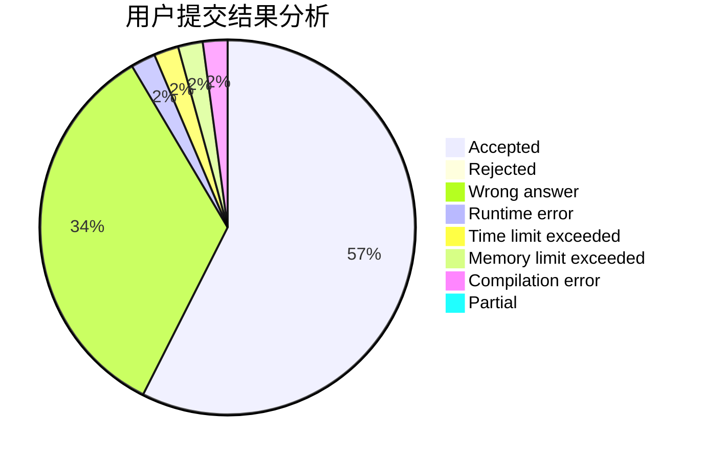
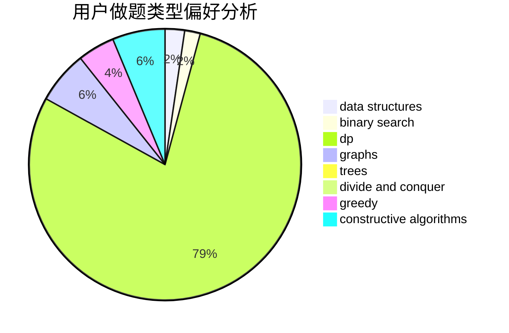
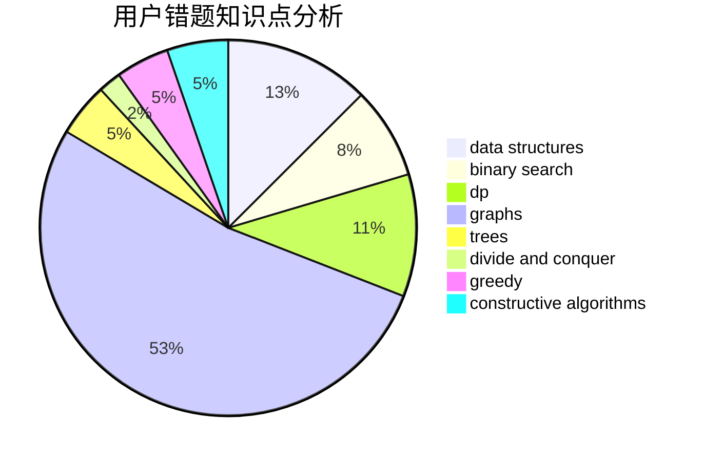

# tzc__wk

<!-- tabs:start -->

#### **用户提交结果分析**

#### **用户做题类型偏好分析**

#### **用户错题知识点分析**

<!-- tabs:end -->
# 推荐题目
[260D](https://codeforces.com/contest/260/problem/D)		constructive algorithms,
                        dsu,
                        graphs,
                        greedy,
                        trees		  
[1469E](https://codeforces.com/contest/1469/problem/E)		bitmasks,
                        brute force,
                        hashing,
                        string suffix structures,
                        strings,
                        two pointers		  
[1151D](https://codeforces.com/contest/1151/problem/D)		greedy,
                        math,
                        sortings		  
[798E](https://codeforces.com/contest/798/problem/E)		constructive algorithms,
                        data structures,
                        graphs,
                        sortings		  
[1155A](https://codeforces.com/contest/1155/problem/A)		implementation,
                        sortings,
                        strings		  
[455B](https://codeforces.com/contest/455/problem/B)		dfs and similar,
                        dp,
                        games,
                        implementation,
                        strings,
                        trees		  
[802A](https://codeforces.com/contest/802/problem/A)		greedy		  
[1230E](https://codeforces.com/contest/1230/problem/E)		dsu,graphs,sortings,trees		  
[714E](https://codeforces.com/contest/714/problem/E)		dsu,graphs,sortings,trees		  
[1155D](https://codeforces.com/contest/1155/problem/D)		brute force,
                        data structures,
                        divide and conquer,
                        dp,
                        greedy		  
