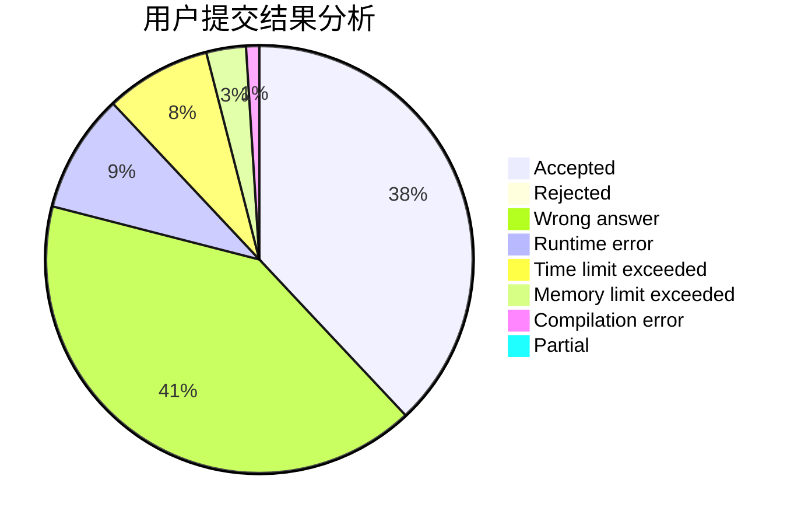
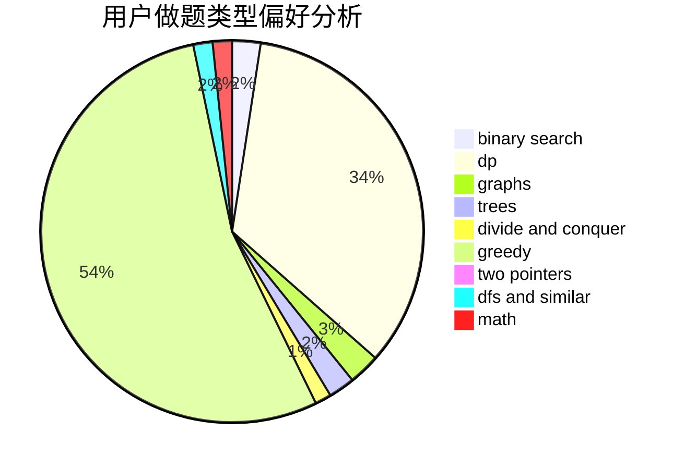

# tzc_wk

<!-- tabs:start -->

#### **用户提交结果分析**

#### **用户做题类型偏好分析**

<!-- tabs:end -->
# 推荐题目
[1344A](https://codeforces.com/contest/1344/problem/A)
[1182C](https://codeforces.com/contest/1182/problem/C)
[1406E](https://codeforces.com/contest/1406/problem/E)
[576C](https://codeforces.com/contest/576/problem/C)
[1358F](https://codeforces.com/contest/1358/problem/F)
[807C](https://codeforces.com/contest/807/problem/C)
[1314F](https://codeforces.com/contest/1314/problem/F)
[1183C](https://codeforces.com/contest/1183/problem/C)
[990A](https://codeforces.com/contest/990/problem/A)
[388D](https://codeforces.com/contest/388/problem/D)
