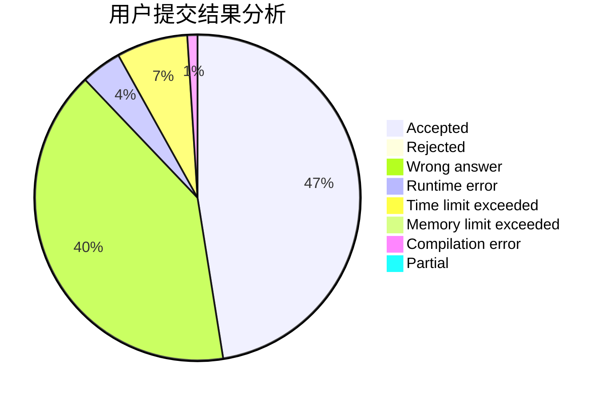
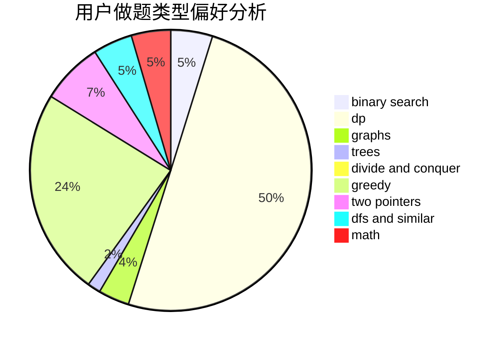

# tzxydby

<!-- tabs:start -->

#### **用户提交结果分析**

#### **用户做题类型偏好分析**

<!-- tabs:end -->
# 推荐题目
[608D](https://codeforces.com/contest/608/problem/D)
[464C](https://codeforces.com/contest/464/problem/C)
[628C](https://codeforces.com/contest/628/problem/C)
[938E](https://codeforces.com/contest/938/problem/E)
[918C](https://codeforces.com/contest/918/problem/C)
[954I](https://codeforces.com/contest/954/problem/I)
[899B](https://codeforces.com/contest/899/problem/B)
[847B](https://codeforces.com/contest/847/problem/B)
[11841](https://codeforces.com/contest/1184/problem/1)
[599D](https://codeforces.com/contest/599/problem/D)
