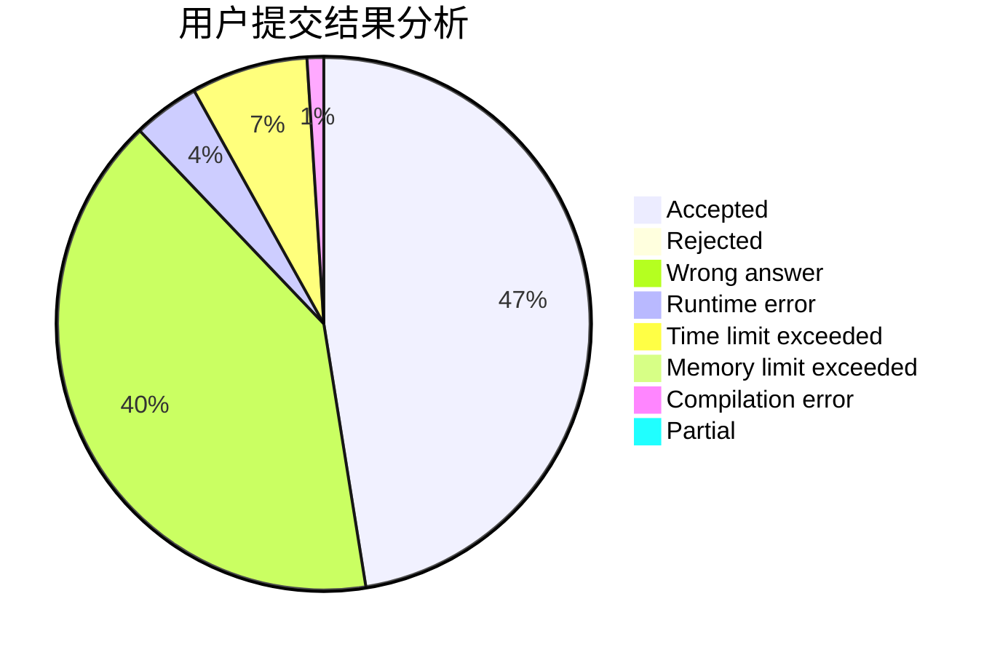
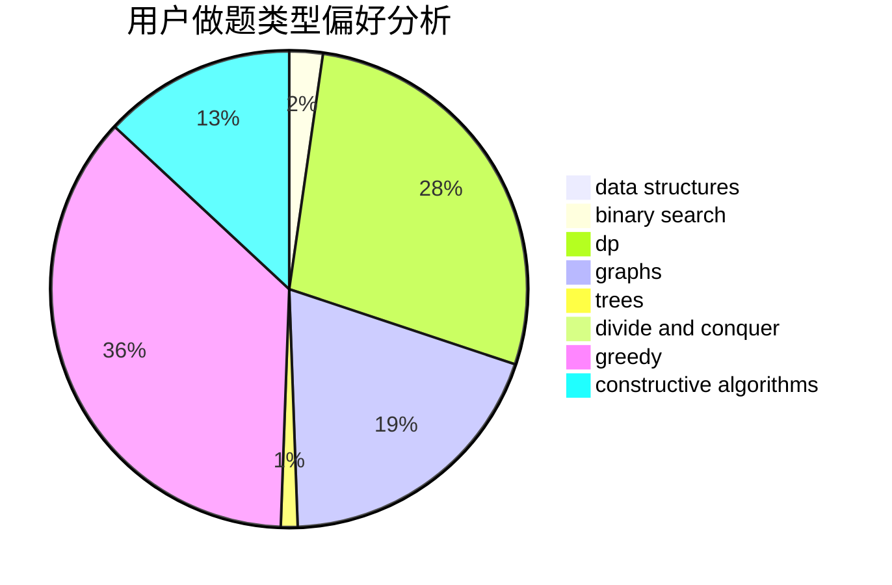
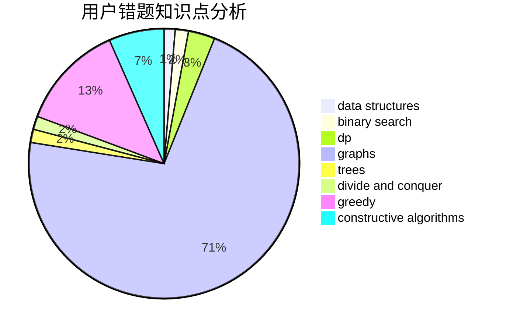

# tzxydby

<!-- tabs:start -->

#### **用户提交结果分析**

#### **用户做题类型偏好分析**

#### **用户错题知识点分析**

<!-- tabs:end -->
# 推荐题目
[588B](https://codeforces.com/contest/588/problem/B)		math		  
[444D](https://codeforces.com/contest/444/problem/D)		binary search,
                        hashing,
                        strings,
                        two pointers		  
[609C](https://codeforces.com/contest/609/problem/C)		implementation,
                        math		  
[918B](https://codeforces.com/contest/918/problem/B)		implementation,
                        strings		  
[902A](https://codeforces.com/contest/902/problem/A)		greedy,
                        implementation		  
[932G](https://codeforces.com/contest/932/problem/G)		dp,
                        string suffix structures,
                        strings		  
[878C](https://codeforces.com/contest/878/problem/C)		data structures,
                        graphs		  
[828D](https://codeforces.com/contest/828/problem/D)		dsu,graphs,sortings,trees		  
[1181D](https://codeforces.com/contest/1181/problem/D)		binary search,
                        data structures,
                        implementation,
                        sortings,
                        trees,
                        two pointers		  
[578B](https://codeforces.com/contest/578/problem/B)		brute force,
                        greedy		  
