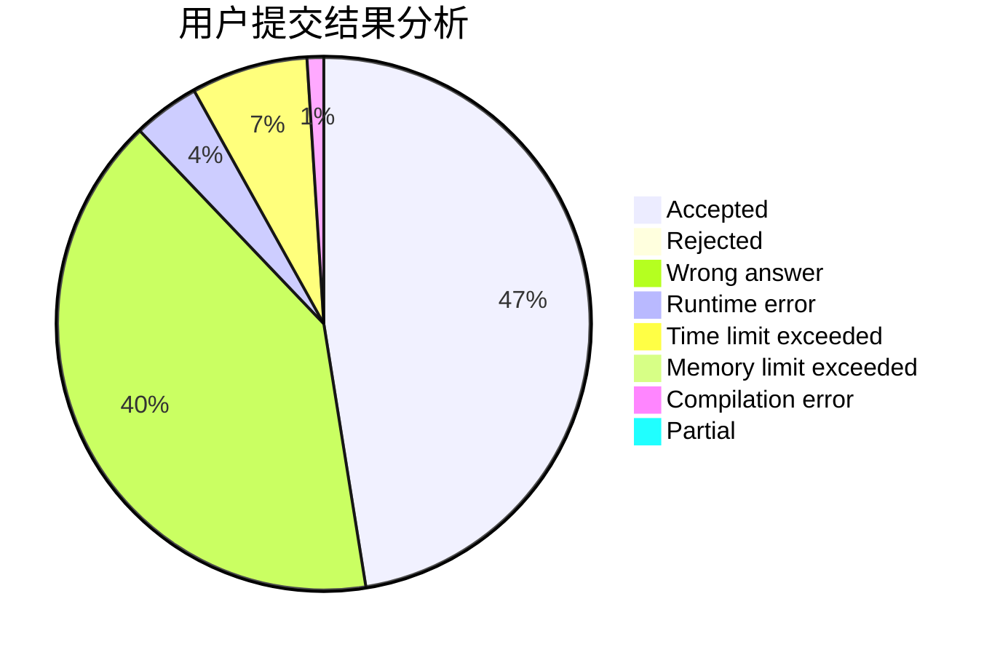
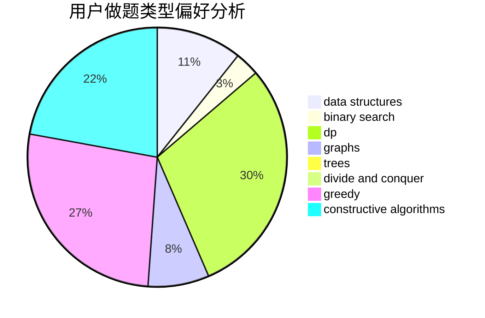
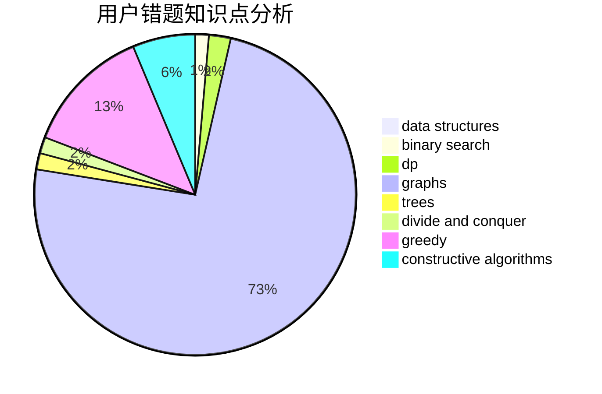

# tzxydby

<!-- tabs:start -->

#### **用户提交结果分析**

#### **用户做题类型偏好分析**

#### **用户错题知识点分析**

<!-- tabs:end -->
# 推荐题目
[608D](https://codeforces.com/contest/608/problem/D)		dsu,graphs,sortings,trees		  
[464C](https://codeforces.com/contest/464/problem/C)		dp		  
[628C](https://codeforces.com/contest/628/problem/C)		greedy,
                        strings		  
[938E](https://codeforces.com/contest/938/problem/E)		combinatorics,
                        math		  
[918C](https://codeforces.com/contest/918/problem/C)		dsu,graphs,sortings,trees		  
[954I](https://codeforces.com/contest/954/problem/I)		fft,
                        math		  
[899B](https://codeforces.com/contest/899/problem/B)		implementation		  
[847B](https://codeforces.com/contest/847/problem/B)		binary search,
                        data structures		  
[11841](https://codeforces.com/contest/1184/problem/1)		dsu,graphs,sortings,trees		  
[599D](https://codeforces.com/contest/599/problem/D)		brute force,
                        math		  
