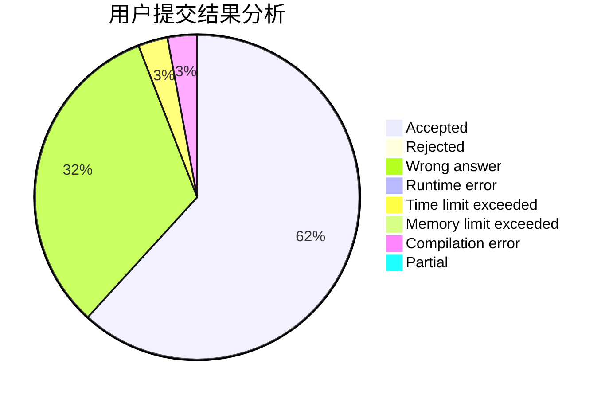
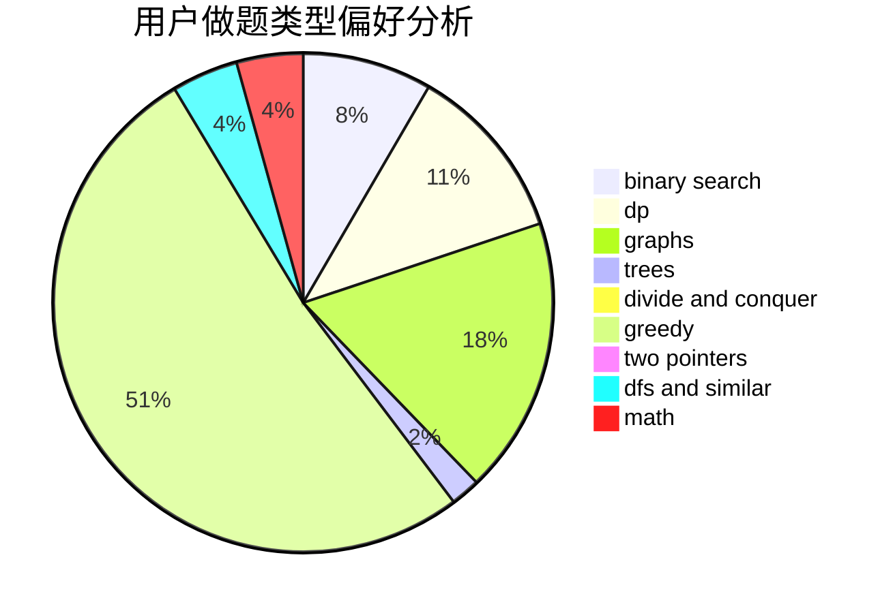

# tzy666

<!-- tabs:start -->

#### **用户提交结果分析**

#### **用户做题类型偏好分析**

<!-- tabs:end -->
# 推荐题目
[896A](https://codeforces.com/contest/896/problem/A)
[1025G](https://codeforces.com/contest/1025/problem/G)
[1205E](https://codeforces.com/contest/1205/problem/E)
[913G](https://codeforces.com/contest/913/problem/G)
[465D](https://codeforces.com/contest/465/problem/D)
[713E](https://codeforces.com/contest/713/problem/E)
[645E](https://codeforces.com/contest/645/problem/E)
[38B](https://codeforces.com/contest/38/problem/B)
[1145B](https://codeforces.com/contest/1145/problem/B)
[1293C](https://codeforces.com/contest/1293/problem/C)
