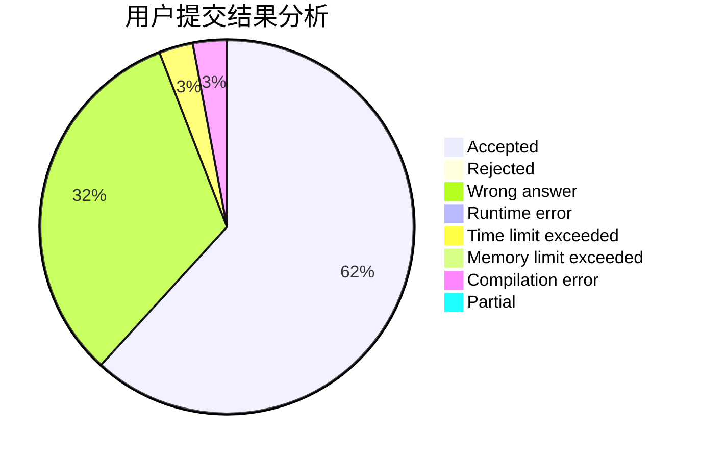
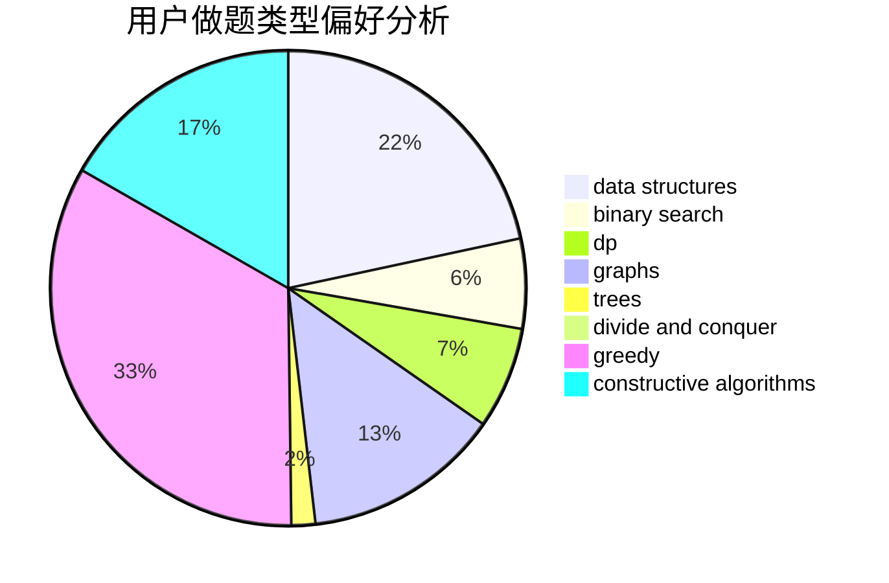
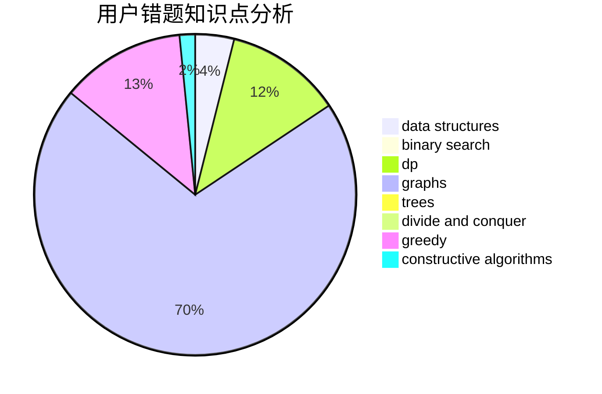

# tzy666

<!-- tabs:start -->

#### **用户提交结果分析**

#### **用户做题类型偏好分析**

#### **用户错题知识点分析**

<!-- tabs:end -->
# 推荐题目
[896A](https://codeforces.com/contest/896/problem/A)		binary search,
                        dfs and similar		  
[1025G](https://codeforces.com/contest/1025/problem/G)		constructive algorithms,
                        math		  
[1205E](https://codeforces.com/contest/1205/problem/E)		combinatorics,
                        strings		  
[913G](https://codeforces.com/contest/913/problem/G)		math,
                        number theory		  
[465D](https://codeforces.com/contest/465/problem/D)		dsu,graphs,sortings,trees		  
[713E](https://codeforces.com/contest/713/problem/E)		binary search,
                        dp		  
[645E](https://codeforces.com/contest/645/problem/E)		dp,
                        greedy,
                        strings		  
[38B](https://codeforces.com/contest/38/problem/B)		brute force,
                        implementation,
                        math		  
[1145B](https://codeforces.com/contest/1145/problem/B)		brute force		  
[1293C](https://codeforces.com/contest/1293/problem/C)		dsu,graphs,sortings,trees		  
