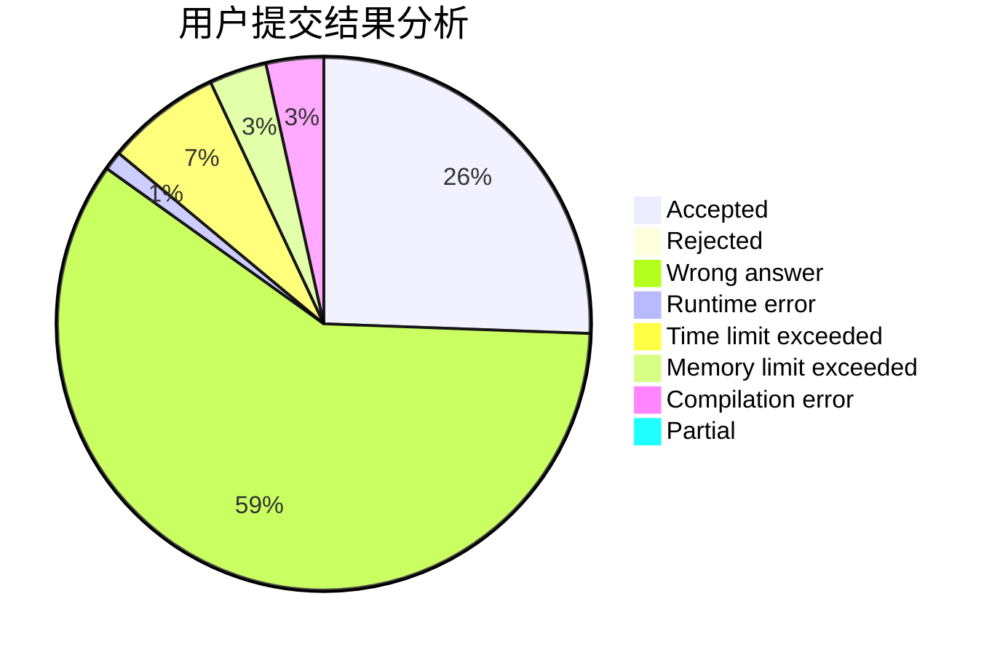
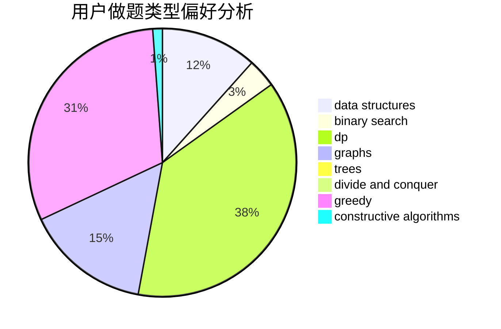

# u_yan

<!-- tabs:start -->

#### **用户提交结果分析**

#### **用户做题类型偏好分析**

#### **用户错题知识点分析**

<!-- tabs:end -->
# 推荐题目
[507B](https://codeforces.com/contest/507/problem/B)		geometry,
                        math		  
[1087A](https://codeforces.com/contest/1087/problem/A)		dsu,graphs,sortings,trees		  
[520E](https://codeforces.com/contest/520/problem/E)		combinatorics,
                        dp,
                        math,
                        number theory		  
[698C](https://codeforces.com/contest/698/problem/C)		bitmasks,
                        dp,
                        math,
                        probabilities		  
[760A](https://codeforces.com/contest/760/problem/A)		implementation,
                        math		  
[620C](https://codeforces.com/contest/620/problem/C)		greedy		  
[1082E](https://codeforces.com/contest/1082/problem/E)		binary search,
                        dp,
                        greedy		  
[1045J](https://codeforces.com/contest/1045/problem/J)		data structures,
                        strings,
                        trees		  
[186C](https://codeforces.com/contest/186/problem/C)		dsu,graphs,sortings,trees		  
[482E](https://codeforces.com/contest/482/problem/E)		data structures,
                        trees		  
