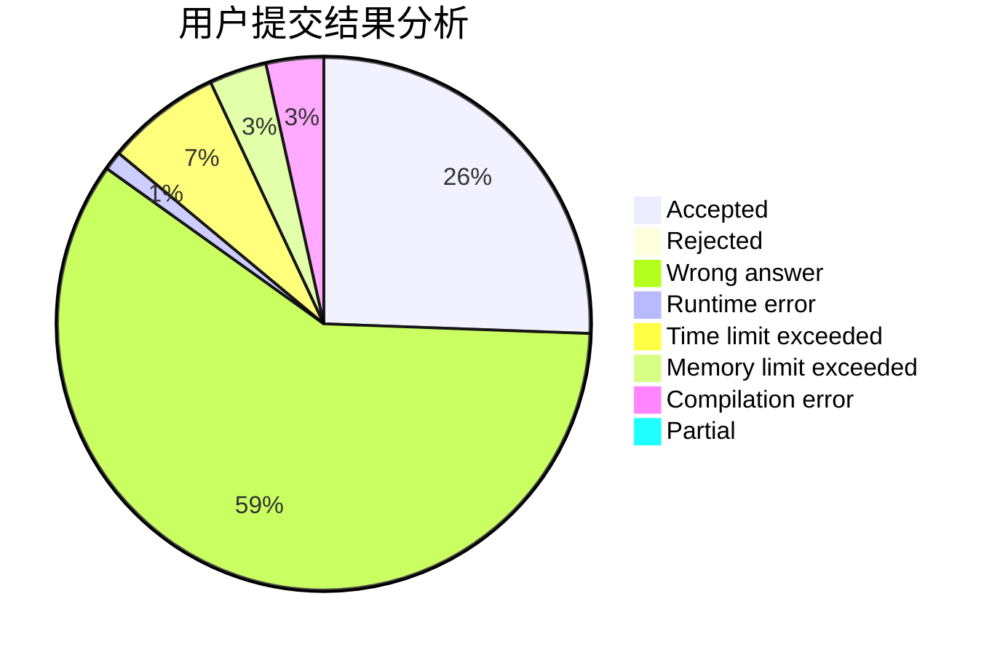
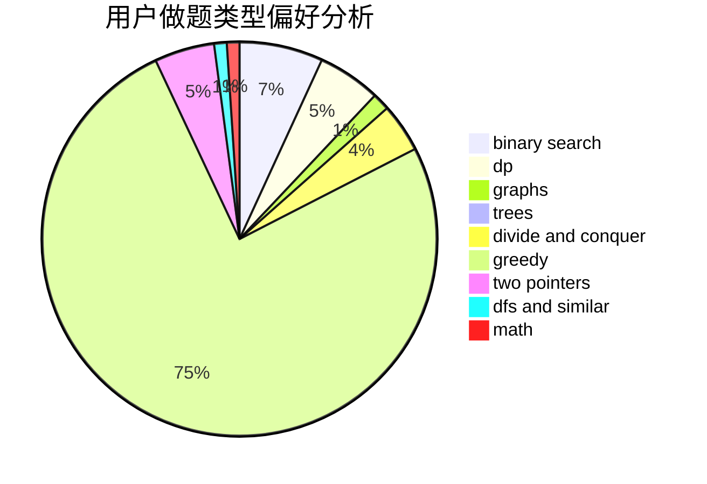

# u_yan

<!-- tabs:start -->

#### **用户提交结果分析**

#### **用户做题类型偏好分析**

<!-- tabs:end -->
# 推荐题目
[527C](https://codeforces.com/contest/527/problem/C)
[1087D](https://codeforces.com/contest/1087/problem/D)
[546D](https://codeforces.com/contest/546/problem/D)
[715A](https://codeforces.com/contest/715/problem/A)
[77E](https://codeforces.com/contest/77/problem/E)
[643F](https://codeforces.com/contest/643/problem/F)
[1083A](https://codeforces.com/contest/1083/problem/A)
[1046I](https://codeforces.com/contest/1046/problem/I)
[212A](https://codeforces.com/contest/212/problem/A)
[501E](https://codeforces.com/contest/501/problem/E)
