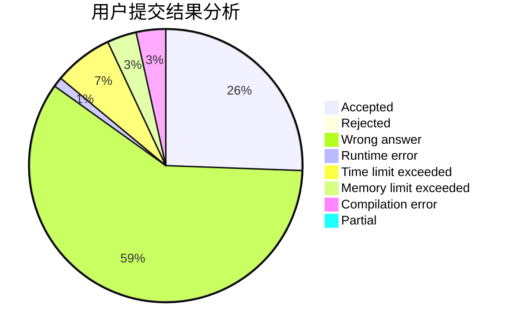
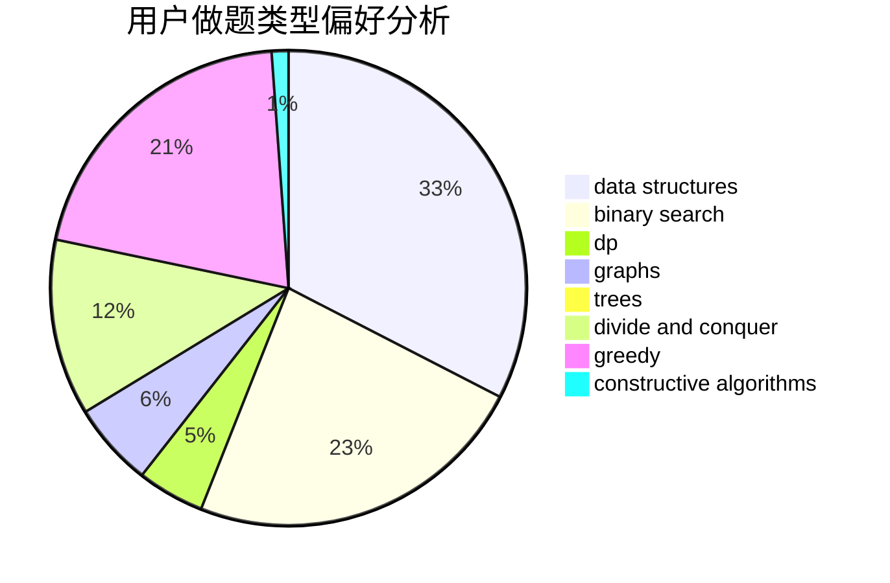

# u_yan

<!-- tabs:start -->

#### **用户提交结果分析**

#### **用户做题类型偏好分析**

#### **用户错题知识点分析**

<!-- tabs:end -->
# 推荐题目
[527C](https://codeforces.com/contest/527/problem/C)		binary search,
                        data structures,
                        implementation		  
[1087D](https://codeforces.com/contest/1087/problem/D)		dsu,graphs,sortings,trees		  
[546D](https://codeforces.com/contest/546/problem/D)		constructive algorithms,
                        dp,
                        math,
                        number theory		  
[715A](https://codeforces.com/contest/715/problem/A)		constructive algorithms,
                        math		  
[77E](https://codeforces.com/contest/77/problem/E)		geometry		  
[643F](https://codeforces.com/contest/643/problem/F)		dp,
                        math,
                        meet-in-the-middle		  
[1083A](https://codeforces.com/contest/1083/problem/A)		data structures,
                        dp,
                        trees		  
[1046I](https://codeforces.com/contest/1046/problem/I)		geometry		  
[212A](https://codeforces.com/contest/212/problem/A)		flows,
                        graphs		  
[501E](https://codeforces.com/contest/501/problem/E)		binary search,
                        combinatorics,
                        implementation		  
