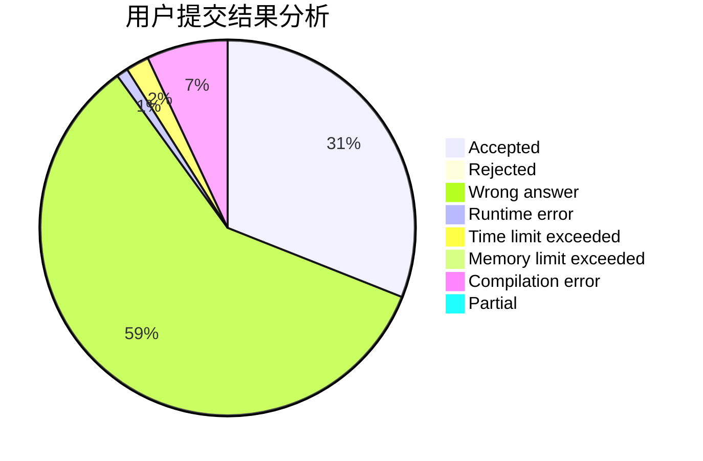
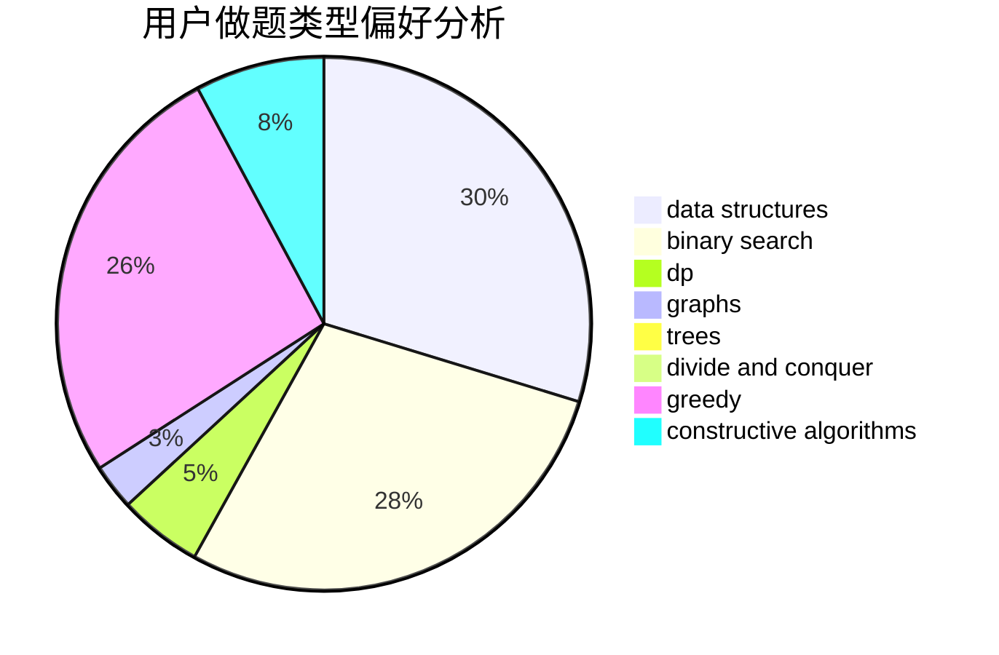
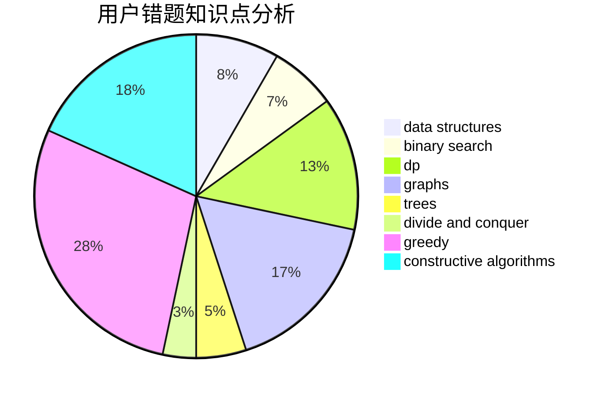

# ufo008ahw

<!-- tabs:start -->

#### **用户提交结果分析**

#### **用户做题类型偏好分析**

#### **用户错题知识点分析**

<!-- tabs:end -->
# 推荐题目
[204C](https://codeforces.com/contest/204/problem/C)		math,
                        probabilities		  
[276D](https://codeforces.com/contest/276/problem/D)		bitmasks,
                        dp,
                        greedy,
                        implementation,
                        math		  
[557B](https://codeforces.com/contest/557/problem/B)		constructive algorithms,
                        implementation,
                        math,
                        sortings		  
[284B](https://codeforces.com/contest/284/problem/B)		brute force,
                        implementation		  
[911D](https://codeforces.com/contest/911/problem/D)		brute force,
                        math		  
[1423G](https://codeforces.com/contest/1423/problem/G)		data structures		  
[898F](https://codeforces.com/contest/898/problem/F)		brute force,
                        hashing,
                        math		  
[398A](https://codeforces.com/contest/398/problem/A)		constructive algorithms,
                        implementation		  
[946C](https://codeforces.com/contest/946/problem/C)		greedy,
                        strings		  
[909C](https://codeforces.com/contest/909/problem/C)		dp		  
