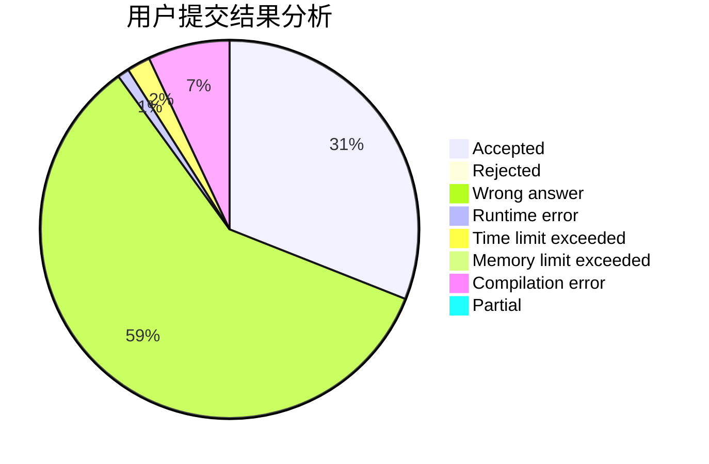
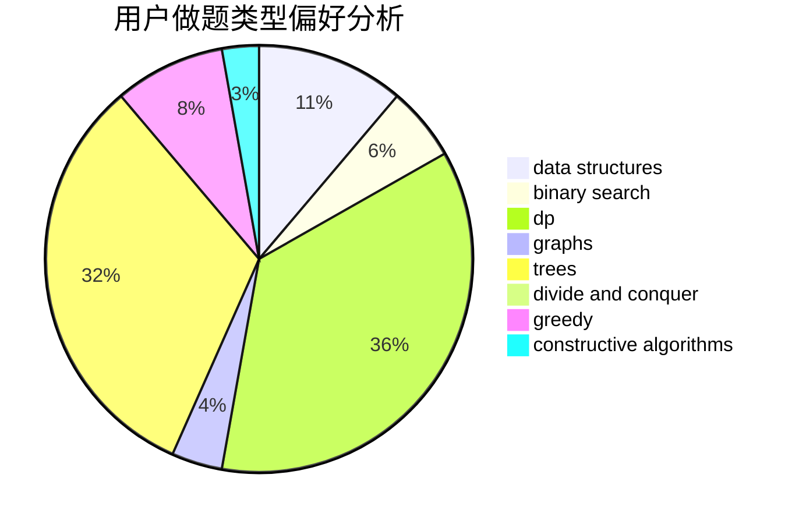
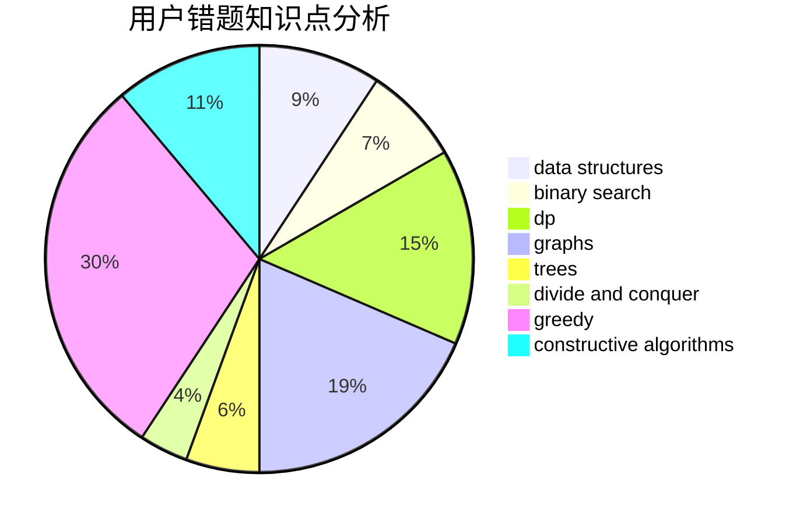

# ufo008ahw

<!-- tabs:start -->

#### **用户提交结果分析**

#### **用户做题类型偏好分析**

#### **用户错题知识点分析**

<!-- tabs:end -->
# 推荐题目
[228B](https://codeforces.com/contest/228/problem/B)		brute force,
                        implementation		  
[291A](https://codeforces.com/contest/291/problem/A)		*special problem,
                        implementation,
                        sortings		  
[580C](https://codeforces.com/contest/580/problem/C)		dfs and similar,
                        graphs,
                        trees		  
[2A](https://codeforces.com/contest/2/problem/A)		hashing,
                        implementation		  
[92B](https://codeforces.com/contest/92/problem/B)		greedy		  
[1431B](https://codeforces.com/contest/1431/problem/B)		*special problem,
                        implementation,
                        two pointers		  
[914H](https://codeforces.com/contest/914/problem/H)		combinatorics,
                        dp,
                        games,
                        trees		  
[424D](https://codeforces.com/contest/424/problem/D)		binary search,
                        brute force,
                        constructive algorithms,
                        data structures,
                        dp		  
[962G](https://codeforces.com/contest/962/problem/G)		data structures,
                        dsu,
                        geometry,
                        trees		  
[924A](https://codeforces.com/contest/924/problem/A)		greedy,
                        implementation		  
