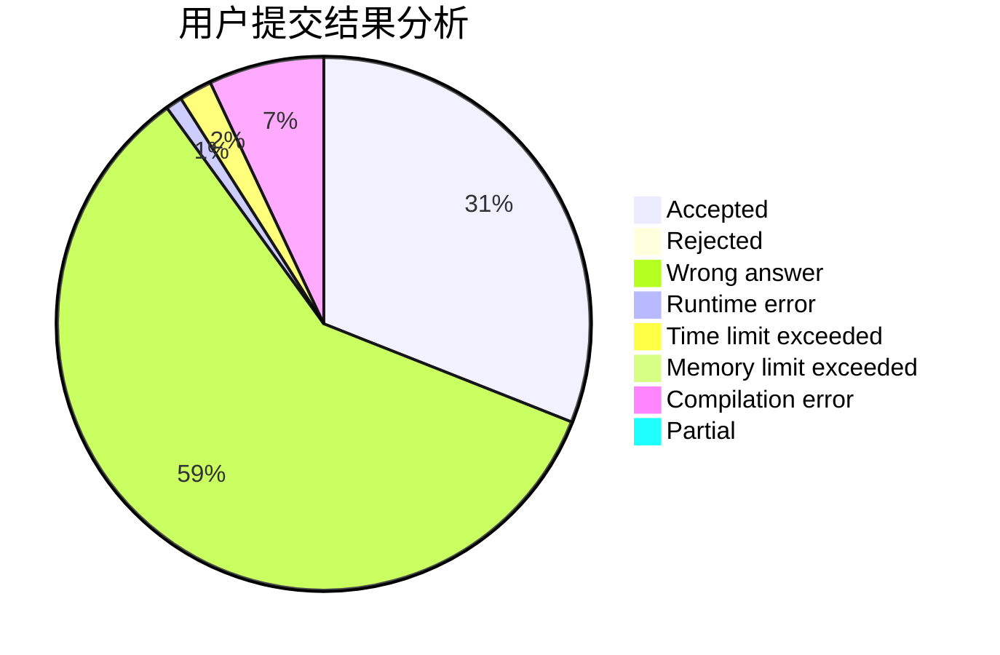
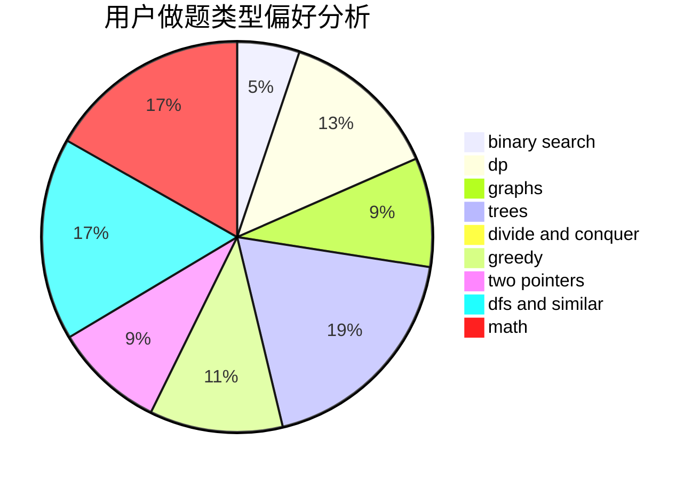

# ufo008ahw

<!-- tabs:start -->

#### **用户提交结果分析**

#### **用户做题类型偏好分析**

<!-- tabs:end -->
# 推荐题目
[228B](https://codeforces.com/contest/228/problem/B)
[291A](https://codeforces.com/contest/291/problem/A)
[580C](https://codeforces.com/contest/580/problem/C)
[2A](https://codeforces.com/contest/2/problem/A)
[92B](https://codeforces.com/contest/92/problem/B)
[1431B](https://codeforces.com/contest/1431/problem/B)
[914H](https://codeforces.com/contest/914/problem/H)
[424D](https://codeforces.com/contest/424/problem/D)
[962G](https://codeforces.com/contest/962/problem/G)
[924A](https://codeforces.com/contest/924/problem/A)
