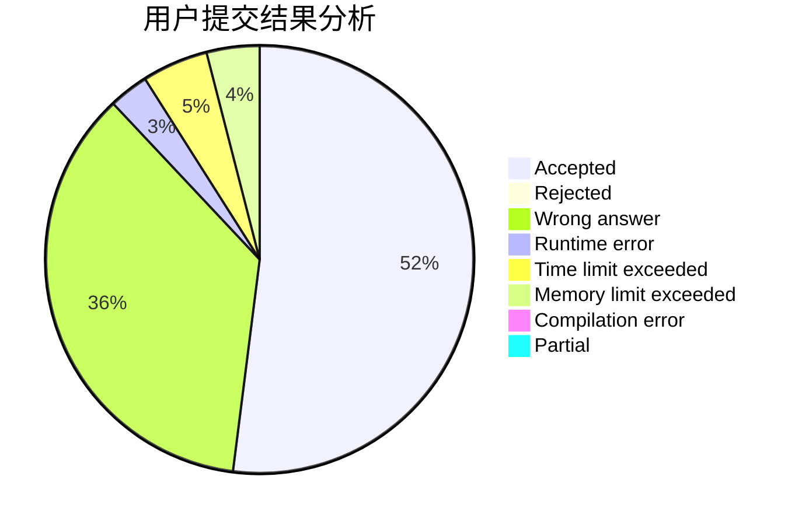
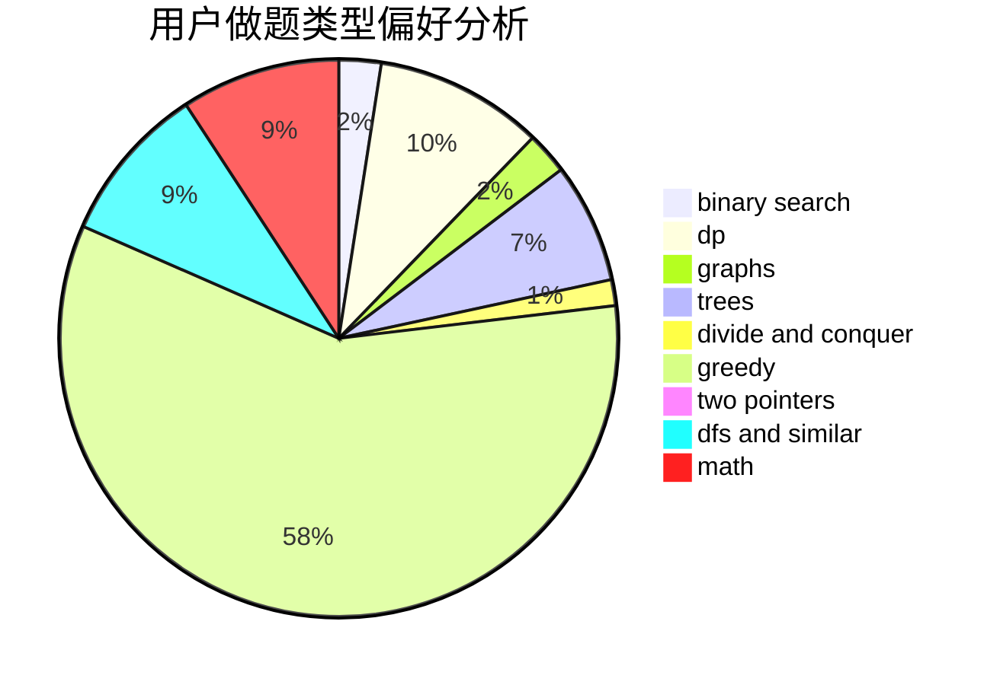

# ugly2333

<!-- tabs:start -->

#### **用户提交结果分析**

#### **用户做题类型偏好分析**

<!-- tabs:end -->
# 推荐题目
[919B](https://codeforces.com/contest/919/problem/B)
[1156D](https://codeforces.com/contest/1156/problem/D)
[107B](https://codeforces.com/contest/107/problem/B)
[1314F](https://codeforces.com/contest/1314/problem/F)
[418B](https://codeforces.com/contest/418/problem/B)
[1311A](https://codeforces.com/contest/1311/problem/A)
[831E](https://codeforces.com/contest/831/problem/E)
[793A](https://codeforces.com/contest/793/problem/A)
[1434E](https://codeforces.com/contest/1434/problem/E)
[898E](https://codeforces.com/contest/898/problem/E)
