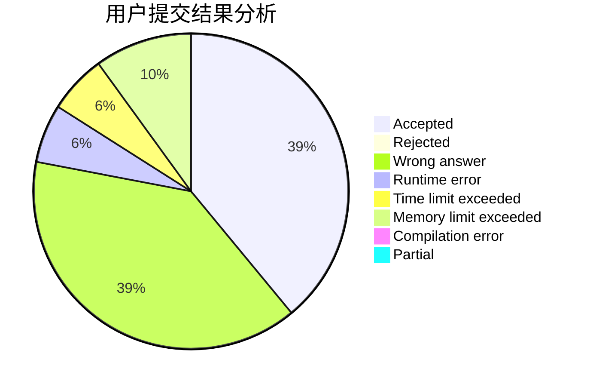
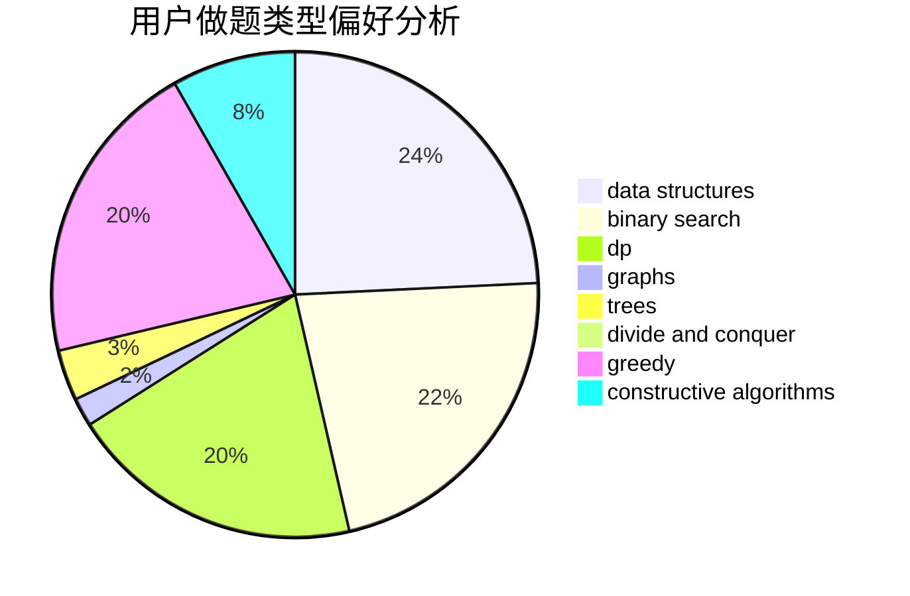
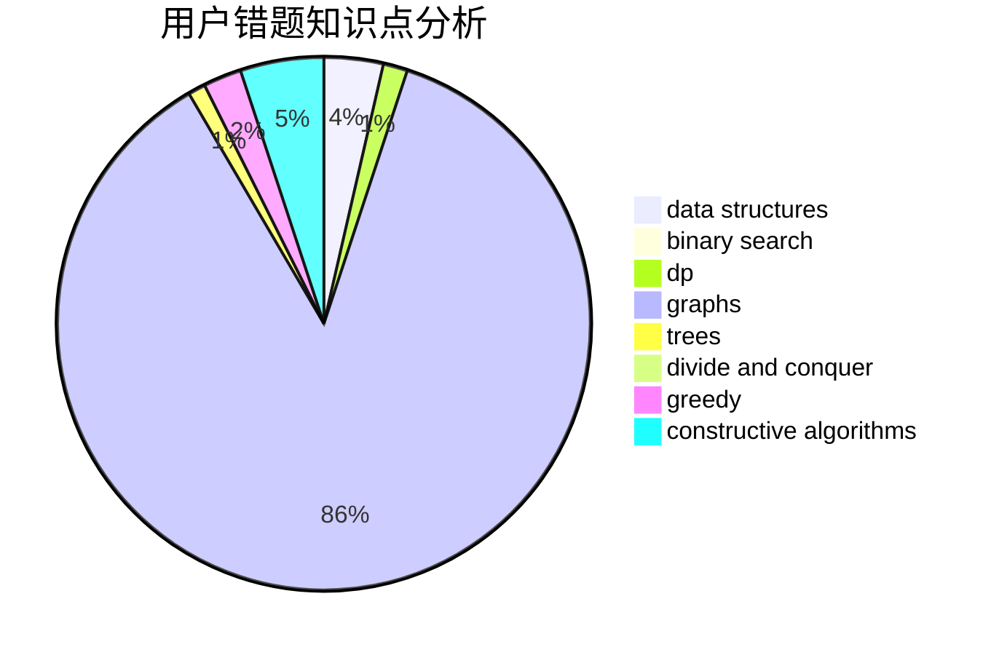

# CXY07

<!-- tabs:start -->

#### **用户提交结果分析**

#### **用户做题类型偏好分析**

#### **用户错题知识点分析**

<!-- tabs:end -->
# 推荐题目
[317A](https://codeforces.com/contest/317/problem/A)		brute force		  
[1349C](https://codeforces.com/contest/1349/problem/C)		dfs and similar,
                        graphs,
                        implementation,
                        shortest paths		  
[543E](https://codeforces.com/contest/543/problem/E)		constructive algorithms,
                        data structures		  
[620E](https://codeforces.com/contest/620/problem/E)		bitmasks,
                        data structures,
                        trees		  
[1103A](https://codeforces.com/contest/1103/problem/A)		constructive algorithms,
                        implementation		  
[1276B](https://codeforces.com/contest/1276/problem/B)		combinatorics,
                        dfs and similar,
                        dsu,
                        graphs		  
[621E](https://codeforces.com/contest/621/problem/E)		dp,
                        matrices		  
[1254B1](https://codeforces.com/contest/1254B/problem/1)		constructive algorithms,
                        greedy,
                        math,
                        number theory,
                        ternary search,
                        two pointers		  
[500C](https://codeforces.com/contest/500/problem/C)		constructive algorithms,
                        greedy,
                        implementation,
                        math		  
[392A](https://codeforces.com/contest/392/problem/A)		math		  
