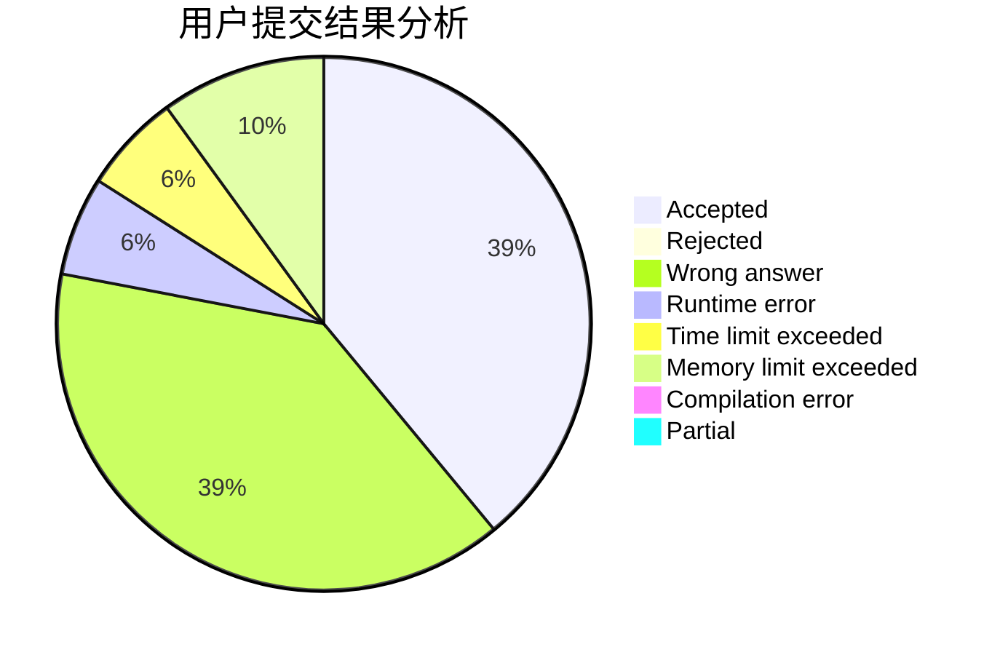
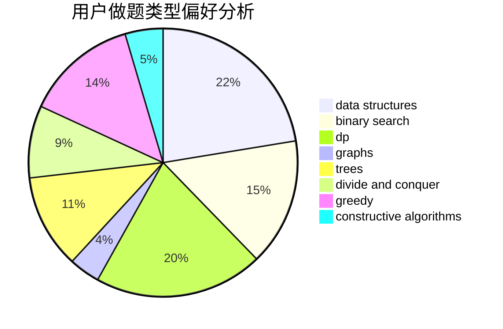
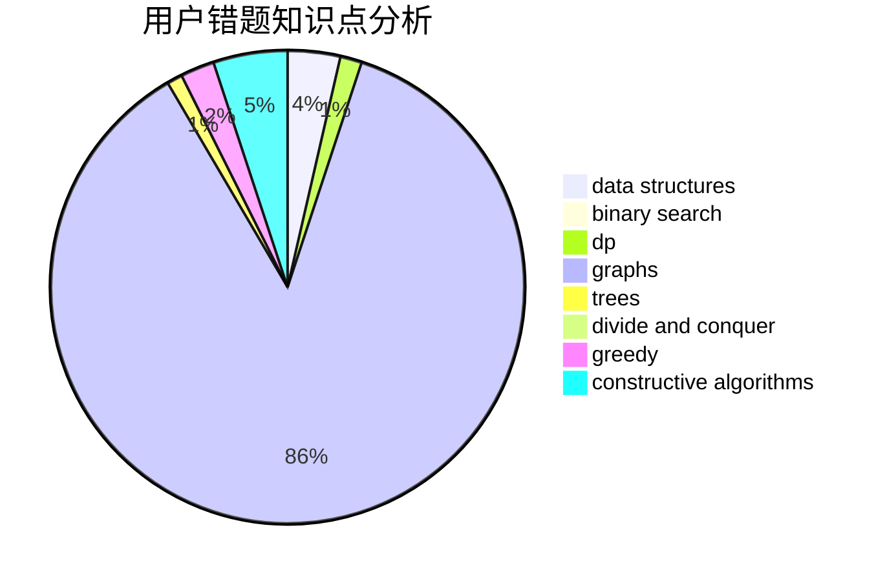

# CXY07

<!-- tabs:start -->

#### **用户提交结果分析**

#### **用户做题类型偏好分析**

#### **用户错题知识点分析**

<!-- tabs:end -->
# 推荐题目
[346B](https://codeforces.com/contest/346/problem/B)		dp,
                        strings		  
[13561](https://codeforces.com/contest/1356/problem/1)		dsu,graphs,sortings,trees		  
[568A](https://codeforces.com/contest/568/problem/A)		brute force,
                        implementation,
                        math,
                        number theory		  
[644A](https://codeforces.com/contest/644/problem/A)		*special problem,
                        constructive algorithms		  
[1103D](https://codeforces.com/contest/1103/problem/D)		bitmasks,
                        dp		  
[1282C](https://codeforces.com/contest/1282/problem/C)		greedy,
                        sortings,
                        two pointers		  
[645G](https://codeforces.com/contest/645/problem/G)		binary search,
                        geometry		  
[1261C](https://codeforces.com/contest/1261/problem/C)		dsu,graphs,sortings,trees		  
[521C](https://codeforces.com/contest/521/problem/C)		dsu,graphs,sortings,trees		  
[420D](https://codeforces.com/contest/420/problem/D)		data structures		  
