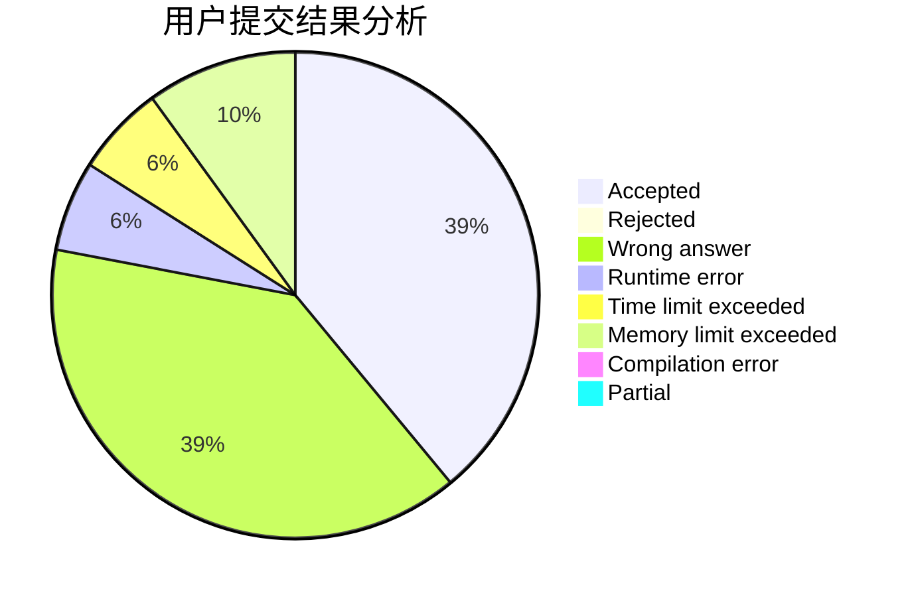
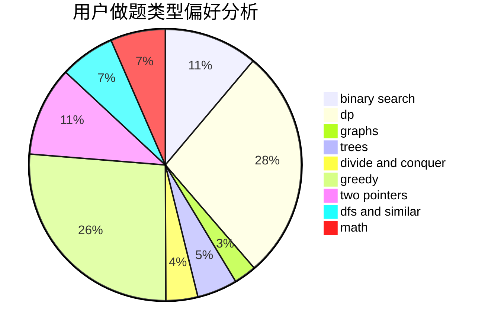

# CXY07

<!-- tabs:start -->

#### **用户提交结果分析**

#### **用户做题类型偏好分析**

<!-- tabs:end -->
# 推荐题目
[346B](https://codeforces.com/contest/346/problem/B)
[13561](https://codeforces.com/contest/1356/problem/1)
[568A](https://codeforces.com/contest/568/problem/A)
[644A](https://codeforces.com/contest/644/problem/A)
[1103D](https://codeforces.com/contest/1103/problem/D)
[1282C](https://codeforces.com/contest/1282/problem/C)
[645G](https://codeforces.com/contest/645/problem/G)
[1261C](https://codeforces.com/contest/1261/problem/C)
[521C](https://codeforces.com/contest/521/problem/C)
[420D](https://codeforces.com/contest/420/problem/D)
