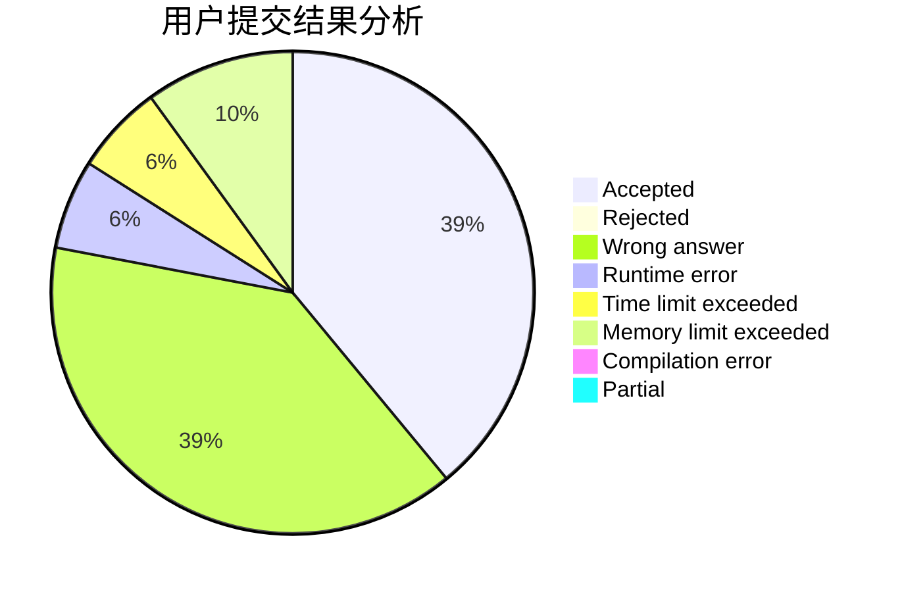
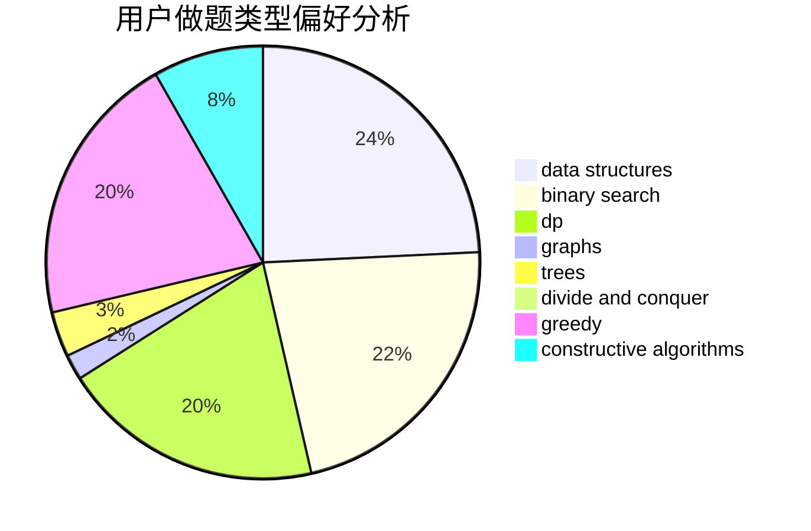
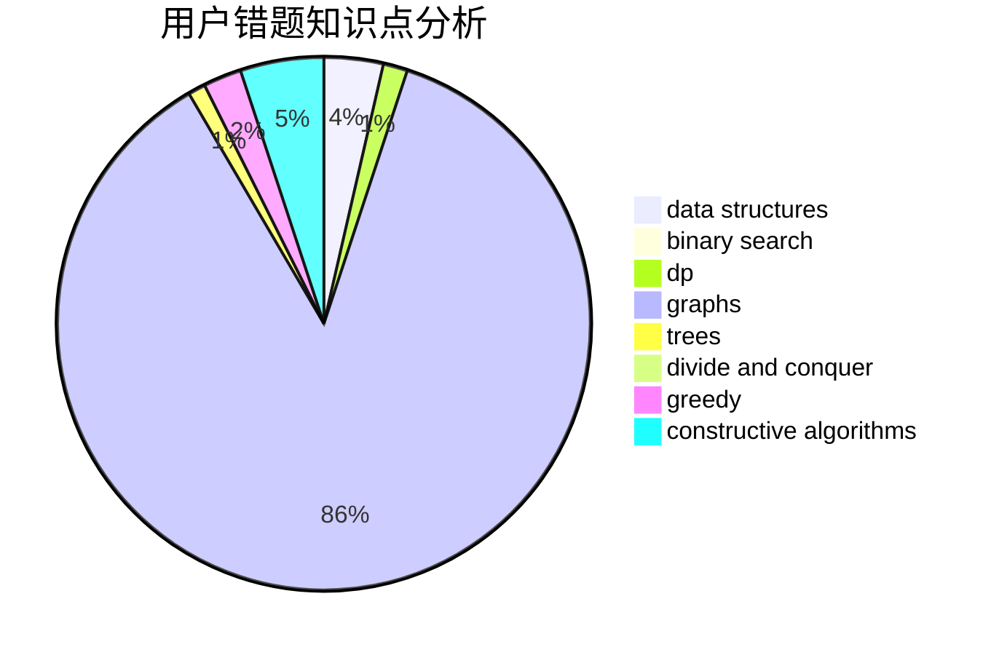

# CXY07
<!-- tabs:start -->
#### **用户提交结果分析**

#### **用户做题类型偏好分析**

#### **用户错题知识点分析**

<!-- tabs:end -->
# 推荐题目
[Orac and Game of Life](http://codeforces.com/problemset/problem/1349/C)		dfs and similar,
                        graphs,
                        implementation,
                        shortest paths		  
[Tiles](http://codeforces.com/problemset/problem/1473/G)		combinatorics,
                        dp,
                        fft,
                        math		  
[Perfect Pair](http://codeforces.com/problemset/problem/317/A)		brute force		  
[Circular Dungeon](http://codeforces.com/problemset/problem/1380/G)		greedy,
                        math,
                        probabilities		  
[Infinite Sequence](http://codeforces.com/problemset/problem/622/A)		implementation,
                        math		  
[Rectangle Painting 1](https://codeforces.com/contest/1199/problem/F)		dp		  
[Tidying Up](http://codeforces.com/problemset/problem/316/C1)		flows		  
[SmartGarden](http://codeforces.com/problemset/problem/1250/M)		constructive algorithms,
                        divide and conquer		  
[Wet Shark and Bishops](http://codeforces.com/problemset/problem/621/B)		combinatorics,
                        implementation		  
[Listening to Music](http://codeforces.com/problemset/problem/543/E)		constructive algorithms,
                        data structures		  
<!-- tabs:start -->
#### **data structures**
[Orac and Game of Life](http://codeforces.com/problemset/problem/543/E)		constructive algorithms,
                        data structures		  
[Tiles](http://codeforces.com/problemset/problem/551/E)		binary search,
                        data structures,
                        implementation		  
[Perfect Pair](https://codeforces.com/contest/1008/problem/C)		combinatorics,
                        data structures,
                        math,
                        sortings,
                        two pointers		  
[Circular Dungeon](https://codeforces.com/contest/1350/problem/C)		data structures,
                        math,
                        number theory		  
[Infinite Sequence](http://codeforces.com/problemset/problem/1479/B2)		constructive algorithms,
                        data structures,
                        dp,
                        greedy,
                        implementation		  
[Rectangle Painting 1](http://codeforces.com/problemset/problem/187/D)		data structures		  
[Tidying Up](http://codeforces.com/problemset/problem/620/E)		bitmasks,
                        data structures,
                        trees		  
[SmartGarden](http://codeforces.com/problemset/problem/1251/E2)		binary search,
                        data structures,
                        greedy		  
[Wet Shark and Bishops](http://codeforces.com/problemset/problem/1472/E)		binary search,
                        data structures,
                        dp,
                        sortings,
                        two pointers		  
[Listening to Music](http://codeforces.com/problemset/problem/620/F)		data structures,
                        strings,
                        trees		  
#### **binary search**
[Orac and Game of Life](http://codeforces.com/problemset/problem/551/E)		binary search,
                        data structures,
                        implementation		  
[Tiles](http://codeforces.com/problemset/problem/51/C)		binary search,
                        greedy		  
[Perfect Pair](http://codeforces.com/problemset/problem/1307/E)		binary search,
                        combinatorics,
                        dp,
                        greedy,
                        implementation,
                        math		  
[Circular Dungeon](http://codeforces.com/problemset/problem/620/D)		binary search,
                        two pointers		  
[Infinite Sequence](http://codeforces.com/problemset/problem/1251/E2)		binary search,
                        data structures,
                        greedy		  
[Rectangle Painting 1](http://codeforces.com/problemset/problem/1472/E)		binary search,
                        data structures,
                        dp,
                        sortings,
                        two pointers		  
[Tidying Up](http://codeforces.com/problemset/problem/1355/C)		binary search,
                        implementation,
                        math,
                        two pointers		  
[SmartGarden](http://codeforces.com/problemset/problem/1442/E)		binary search,
                        constructive algorithms,
                        dfs and similar,
                        dp,
                        greedy,
                        trees		  
[Wet Shark and Bishops](http://codeforces.com/problemset/problem/1492/C)		binary search,
                        data structures,
                        dp,
                        greedy,
                        two pointers		  
[Listening to Music](http://codeforces.com/problemset/problem/1463/D)		binary search,
                        constructive algorithms,
                        greedy,
                        two pointers		  
#### **dp**
[Orac and Game of Life](http://codeforces.com/problemset/problem/1473/G)		combinatorics,
                        dp,
                        fft,
                        math		  
[Tiles](https://codeforces.com/contest/1199/problem/F)		dp		  
[Perfect Pair](http://codeforces.com/problemset/problem/621/E)		dp,
                        matrices		  
[Circular Dungeon](http://codeforces.com/problemset/problem/176/D)		dp		  
[Infinite Sequence](http://codeforces.com/problemset/problem/319/C)		dp,
                        geometry		  
[Rectangle Painting 1](http://codeforces.com/problemset/problem/1307/E)		binary search,
                        combinatorics,
                        dp,
                        greedy,
                        implementation,
                        math		  
[Tidying Up](http://codeforces.com/problemset/problem/1479/B2)		constructive algorithms,
                        data structures,
                        dp,
                        greedy,
                        implementation		  
[SmartGarden](http://codeforces.com/problemset/problem/1060/F)		combinatorics,
                        dp		  
[Wet Shark and Bishops](http://codeforces.com/problemset/problem/1158/F)		dp,
                        math		  
[Listening to Music](http://codeforces.com/problemset/problem/1198/D)		dp		  
#### **graph**
[Orac and Game of Life](http://codeforces.com/problemset/problem/1349/C)		dfs and similar,
                        graphs,
                        implementation,
                        shortest paths		  
[Tiles](http://codeforces.com/problemset/problem/290/C)		*special problem,
                        graph matchings,
                        implementation,
                        trees		  
[Perfect Pair](http://codeforces.com/problemset/problem/1276/B)		combinatorics,
                        dfs and similar,
                        dsu,
                        graphs		  
[Circular Dungeon](http://codeforces.com/problemset/problem/1487/C)		brute force,
                        constructive algorithms,
                        dfs and similar,
                        graphs,
                        greedy,
                        implementation,
                        math		  
[Infinite Sequence](http://codeforces.com/problemset/problem/1437/C)		dp,
                        flows,
                        graph matchings,
                        greedy,
                        math,
                        sortings		  
[Rectangle Painting 1](http://codeforces.com/problemset/problem/1470/D)		constructive algorithms,
                        dfs and similar,
                        graph matchings,
                        graphs,
                        greedy		  
[Tidying Up](http://codeforces.com/problemset/problem/1476/C)		dp,
                        graphs,
                        greedy		  
[SmartGarden](http://codeforces.com/problemset/problem/1304/D)		constructive algorithms,
                        graphs,
                        greedy,
                        two pointers		  
[Wet Shark and Bishops](http://codeforces.com/problemset/problem/1475/C)		combinatorics,
                        graphs,
                        math		  
[Listening to Music](http://codeforces.com/problemset/problem/553/E)		dp,
                        fft,
                        graphs,
                        math,
                        probabilities		  
#### **trees**
[Orac and Game of Life](http://codeforces.com/problemset/problem/566/A)		dfs and similar,
                        strings,
                        trees		  
[Tiles](http://codeforces.com/problemset/problem/290/C)		*special problem,
                        graph matchings,
                        implementation,
                        trees		  
[Perfect Pair](http://codeforces.com/problemset/problem/620/E)		bitmasks,
                        data structures,
                        trees		  
[Circular Dungeon](http://codeforces.com/problemset/problem/620/F)		data structures,
                        strings,
                        trees		  
[Infinite Sequence](http://codeforces.com/problemset/problem/1442/E)		binary search,
                        constructive algorithms,
                        dfs and similar,
                        dp,
                        greedy,
                        trees		  
[Rectangle Painting 1](http://codeforces.com/problemset/problem/1479/D)		binary search,
                        bitmasks,
                        brute force,
                        data structures,
                        probabilities,
                        trees		  
[Tidying Up](http://codeforces.com/problemset/problem/1511/C)		brute force,
                        data structures,
                        implementation,
                        trees		  
[SmartGarden](http://codeforces.com/problemset/problem/1499/F)		combinatorics,
                        dfs and similar,
                        dp,
                        trees		  
[Wet Shark and Bishops](http://codeforces.com/problemset/problem/1491/E)		brute force,
                        dfs and similar,
                        divide and conquer,
                        number theory,
                        trees		  
[Listening to Music](http://codeforces.com/problemset/problem/1466/D)		data structures,
                        greedy,
                        sortings,
                        trees		  
#### **divide and conquer**
[Orac and Game of Life](http://codeforces.com/problemset/problem/1250/M)		constructive algorithms,
                        divide and conquer		  
[Tiles](http://codeforces.com/problemset/problem/1461/D)		binary search,
                        brute force,
                        data structures,
                        divide and conquer,
                        implementation,
                        sortings		  
[Perfect Pair](http://codeforces.com/problemset/problem/1466/G)		combinatorics,
                        divide and conquer,
                        hashing,
                        math,
                        string suffix structures,
                        strings		  
[Circular Dungeon](http://codeforces.com/problemset/problem/1490/D)		dfs and similar,
                        divide and conquer,
                        implementation		  
[Infinite Sequence](https://codeforces.com/contest/1483/problem/C)		data structures,
                        divide and conquer,
                        dp		  
[Rectangle Painting 1](http://codeforces.com/problemset/problem/1491/E)		brute force,
                        dfs and similar,
                        divide and conquer,
                        number theory,
                        trees		  
[Tidying Up](http://codeforces.com/problemset/problem/1303/G)		data structures,
                        divide and conquer,
                        geometry,
                        trees		  
[SmartGarden](http://codeforces.com/problemset/problem/1494/D)		constructive algorithms,
                        data structures,
                        dfs and similar,
                        divide and conquer,
                        dsu,
                        greedy,
                        sortings,
                        trees		  
[Wet Shark and Bishops](http://codeforces.com/problemset/problem/1482/E)		data structures,
                        divide and conquer,
                        dp		  
[Listening to Music](http://codeforces.com/problemset/problem/566/C)		dfs and similar,
                        divide and conquer,
                        trees		  
#### **greedy**
[Orac and Game of Life](http://codeforces.com/problemset/problem/1380/G)		greedy,
                        math,
                        probabilities		  
[Tiles](http://codeforces.com/problemset/problem/500/C)		constructive algorithms,
                        greedy,
                        implementation,
                        math		  
[Perfect Pair](http://codeforces.com/problemset/problem/436/A)		greedy		  
[Circular Dungeon](http://codeforces.com/problemset/problem/1254/B1)		constructive algorithms,
                        greedy,
                        math,
                        number theory,
                        ternary search,
                        two pointers		  
[Infinite Sequence](http://codeforces.com/problemset/problem/51/C)		binary search,
                        greedy		  
[Rectangle Painting 1](http://codeforces.com/problemset/problem/1167/D)		constructive algorithms,
                        greedy		  
[Tidying Up](http://codeforces.com/problemset/problem/1307/E)		binary search,
                        combinatorics,
                        dp,
                        greedy,
                        implementation,
                        math		  
[SmartGarden](http://codeforces.com/problemset/problem/1479/B2)		constructive algorithms,
                        data structures,
                        dp,
                        greedy,
                        implementation		  
[Wet Shark and Bishops](http://codeforces.com/problemset/problem/1252/E)		greedy,
                        two pointers		  
[Listening to Music](http://codeforces.com/problemset/problem/1251/E2)		binary search,
                        data structures,
                        greedy		  
#### **constructive algorithms**
[Orac and Game of Life](http://codeforces.com/problemset/problem/1250/M)		constructive algorithms,
                        divide and conquer		  
[Tiles](http://codeforces.com/problemset/problem/543/E)		constructive algorithms,
                        data structures		  
[Perfect Pair](http://codeforces.com/problemset/problem/500/C)		constructive algorithms,
                        greedy,
                        implementation,
                        math		  
[Circular Dungeon](http://codeforces.com/problemset/problem/1254/B1)		constructive algorithms,
                        greedy,
                        math,
                        number theory,
                        ternary search,
                        two pointers		  
[Infinite Sequence](http://codeforces.com/problemset/problem/1167/D)		constructive algorithms,
                        greedy		  
[Rectangle Painting 1](http://codeforces.com/problemset/problem/1479/B2)		constructive algorithms,
                        data structures,
                        dp,
                        greedy,
                        implementation		  
[Tidying Up](http://codeforces.com/problemset/problem/621/D)		brute force,
                        constructive algorithms,
                        math		  
[SmartGarden](http://codeforces.com/problemset/problem/1103/A)		constructive algorithms,
                        implementation		  
[Wet Shark and Bishops](http://codeforces.com/problemset/problem/1442/E)		binary search,
                        constructive algorithms,
                        dfs and similar,
                        dp,
                        greedy,
                        trees		  
[Listening to Music](http://codeforces.com/problemset/problem/1493/A)		constructive algorithms,
                        greedy		  
#### **sortings**
[Orac and Game of Life](https://codeforces.com/contest/1008/problem/C)		combinatorics,
                        data structures,
                        math,
                        sortings,
                        two pointers		  
[Tiles](http://codeforces.com/problemset/problem/158/E)		*special problem,
                        dp,
                        sortings		  
[Perfect Pair](http://codeforces.com/problemset/problem/1472/E)		binary search,
                        data structures,
                        dp,
                        sortings,
                        two pointers		  
[Circular Dungeon](http://codeforces.com/problemset/problem/1272/A)		brute force,
                        greedy,
                        math,
                        sortings		  
[Infinite Sequence](http://codeforces.com/problemset/problem/1282/C)		greedy,
                        sortings,
                        two pointers		  
[Rectangle Painting 1](https://codeforces.com/contest/1496/problem/C)		geometry,
                        greedy,
                        math,
                        sortings		  
[Tidying Up](http://codeforces.com/problemset/problem/1495/A)		geometry,
                        greedy,
                        math,
                        sortings		  
[SmartGarden](http://codeforces.com/problemset/problem/1497/A)		brute force,
                        data structures,
                        greedy,
                        sortings		  
[Wet Shark and Bishops](http://codeforces.com/problemset/problem/1427/A)		math,
                        sortings		  
[Listening to Music](http://codeforces.com/problemset/problem/1461/D)		binary search,
                        brute force,
                        data structures,
                        divide and conquer,
                        implementation,
                        sortings		  
<!-- tabs:end -->
