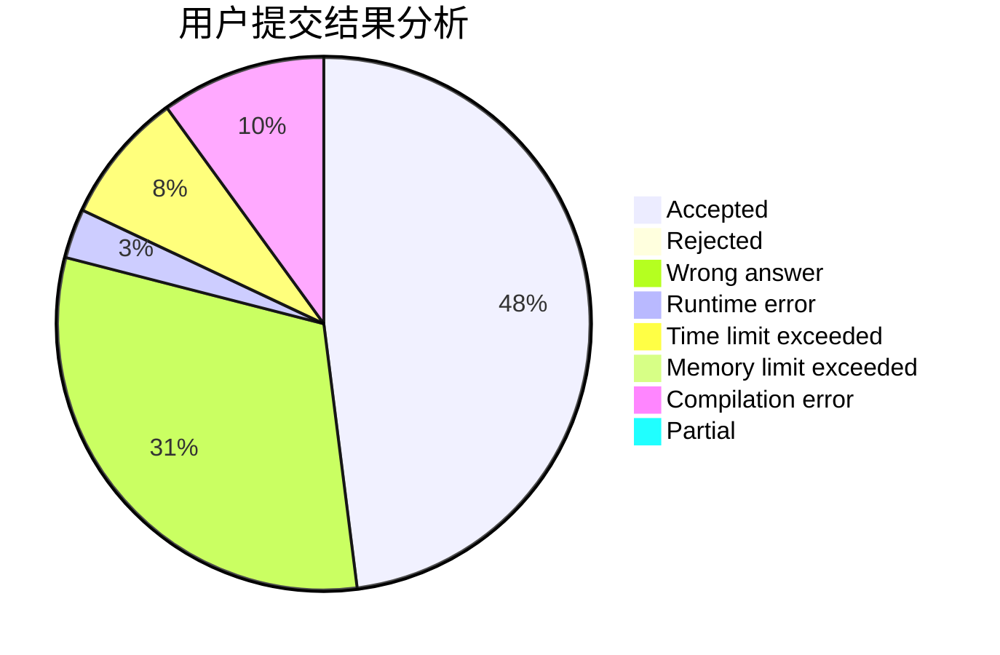
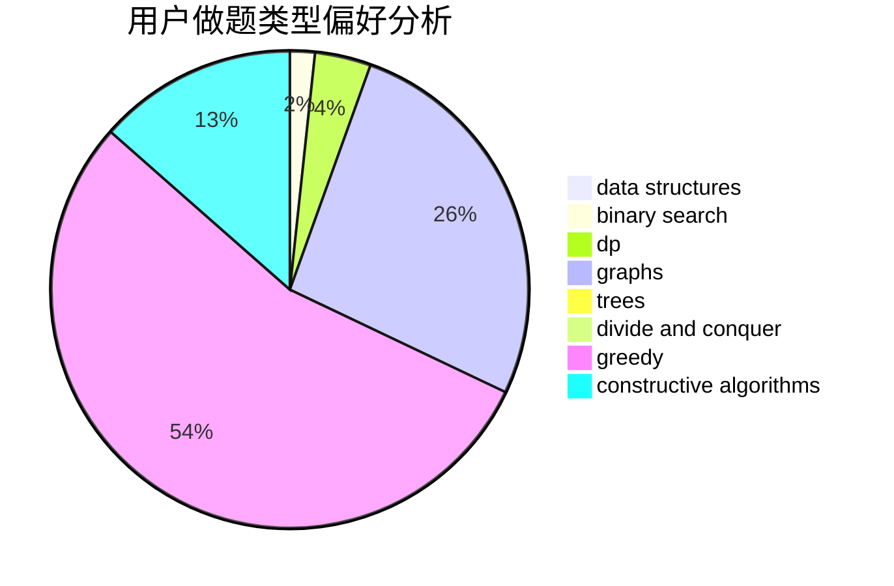

# uk224

<!-- tabs:start -->

#### **用户提交结果分析**

#### **用户做题类型偏好分析**

#### **用户错题知识点分析**

<!-- tabs:end -->
# 推荐题目
[768C](https://codeforces.com/contest/768/problem/C)		brute force,
                        dp,
                        implementation,
                        sortings		  
[1120F](https://codeforces.com/contest/1120/problem/F)		data structures,
                        dp,
                        greedy		  
[163E](https://codeforces.com/contest/163/problem/E)		data structures,
                        dfs and similar,
                        dp,
                        strings,
                        trees		  
[316B2](https://codeforces.com/contest/316B/problem/2)		dfs and similar,
                        dp		  
[782B](https://codeforces.com/contest/782/problem/B)		dsu,graphs,sortings,trees		  
[912A](https://codeforces.com/contest/912/problem/A)		implementation		  
[902A](https://codeforces.com/contest/902/problem/A)		greedy,
                        implementation		  
[1266D](https://codeforces.com/contest/1266/problem/D)		constructive algorithms,
                        data structures,
                        graphs,
                        greedy,
                        implementation,
                        math,
                        two pointers		  
[1285F](https://codeforces.com/contest/1285/problem/F)		binary search,
                        combinatorics,
                        number theory		  
[725F](https://codeforces.com/contest/725/problem/F)		games,
                        greedy		  
