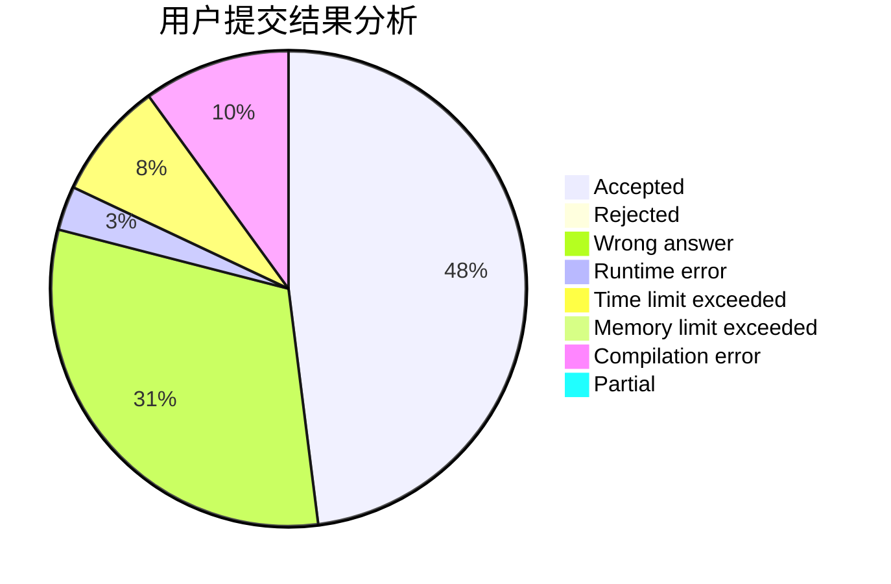
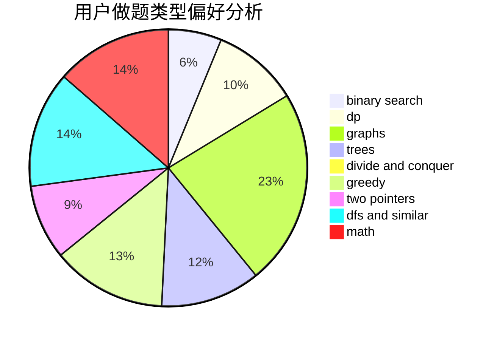

# uk224

<!-- tabs:start -->

#### **用户提交结果分析**

#### **用户做题类型偏好分析**

<!-- tabs:end -->
# 推荐题目
[788B](https://codeforces.com/contest/788/problem/B)
[11302](https://codeforces.com/contest/1130/problem/2)
[189E](https://codeforces.com/contest/189/problem/E)
[33D](https://codeforces.com/contest/33/problem/D)
[800A](https://codeforces.com/contest/800/problem/A)
[930D](https://codeforces.com/contest/930/problem/D)
[918C](https://codeforces.com/contest/918/problem/C)
[1271E](https://codeforces.com/contest/1271/problem/E)
[1293A](https://codeforces.com/contest/1293/problem/A)
[744A](https://codeforces.com/contest/744/problem/A)
